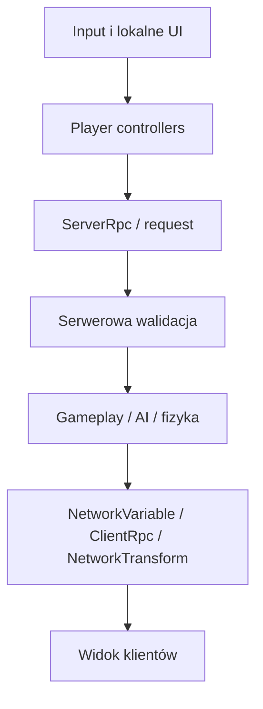

# Architektura i networking

## Status

**Gotowe z aktywnym rozwojem.** Projekt używa Unity Netcode for GameObjects.
Gameplay, AI, produkcja, montaż i fizyka shared-carry są autorytatywne po
stronie serwera. Lokalne wejście, kamera i HUD działają u ownera.

## Warstwy projektu

| Warstwa | Główne odpowiedzialności |
|---|---|
| Dane | SO zasobów, części, workflow, narzędzi, NPC i profili fizyki |
| Obiekty świata | `BaseResourceNew`, `MountableBridgeComponent`, fabryki, NPC |
| Orkiestracja | `GameplayManager`, timer, spawn manager, room manager |
| Gracz | input, movement, interaction, action, inventory, health |
| Prezentacja | HUD, prompty, outline, feedback FPP, world-space UI |

## Authority

| System | Źródło prawdy |
|---|---|
| Pickup/drop i holderzy | serwer |
| Shared-carry Rigidbody | serwer |
| AI i NavMesh | serwer |
| Alarmy frakcji NPC i rezerwacje eskorty | serwer, runtime-only |
| NPC carry powalonego gracza i rezerwacja celu | serwer |
| Pauza timera respawnu podczas NPC carry | serwerowy timestamp |
| Damage, durability i construction work | serwer w sesji NGO |
| Produkcja i magazyny | serwer |
| Timer i wynik poziomu | serwer |
| Kamera, crosshair, outline, HUD | lokalny owner |
| FPS i Camera Motion | lokalny proces |

Singleplayer używa tych samych komponentów, ale gdy `NetworkManager` nie
nasłuchuje, metody wykonują lokalną ścieżkę bez RPC.

Powalony gracz przechowuje carrier przez `NetworkObjectId`, a stan carry jest
odtwarzany z `NetworkVariable` także dla late join. Owner gracza podąża rootem za
`ICarriedPlayerAnchorProvider`; pozostali klienci odtwarzają visual override.
Serwer rozpoczyna i kończy pauzę respawnu razem z NPC carry. Timestamp początku
pauzy jest synchronizowany, a przy dropie `downedAtTime` zostaje przesunięty o
czas transportu.

## Ładowanie scen

`GameplaySceneRegistry` rozpoznaje `FPP_scene` i `Tutorial_scene`.
`MultiplayerRoomManager` pozwala hostowi rozpocząć jedną z nich przez
`NetworkManager.SceneManager.LoadScene`. Klient nie ma uprawnień do startu.

`PlayerSpawnManager` reaguje na ukończenie ładowania, wybiera wolny
`PlayerSpawnPoint` i tworzy player object dla każdego klienta. Po spawnie
owner otrzymuje potwierdzenie pozycji, co zapobiega pozostaniu przy scenowym
fallbacku lub przy moście.

### Konfiguracja managerów lobby i spawnu

| Grupa pól | Znaczenie |
|---|---|
| przyciski host/join/start | Referencje UI; start scen jest host-only |
| status i player list | Stan pokoju oraz lista uczestników |
| player prefab | Sieciowy prefab `PlayerNew` |
| spawn points | Punkty wybierane dla nowych i odradzanych graczy |

Każdy spawn point powinien znajdować się na wolnym terenie, mieć poprawny yaw
i nie przecinać colliderów. W tutorialu wszystkie punkty startowe należą do
obozu.

## Player network setup

`PlayerNetworkSetup` rozdziela lokalnego ownera od zdalnych prefabów:

- przypina Cinemachine `Follow` i `LookAt` do lokalnego targetu;
- przekazuje aktywną kamerę do `PlayerInteractionNew`;
- aktywuje lokalny Canvas, audio listener, input i FPP arms;
- wyłącza owner-only UI oraz kamery na zdalnych graczach;
- po re-spawnie ponawia binding kamery;
- po despawnie czyści statyczne referencje.

| Referencja | Rola |
|---|---|
| `CinemachineCameraTarget` | Bazowy target pitch/yaw |
| feedback target/composer | Nakłada movement, turn, damage i action feedback |
| local Canvas | HUD, prompty, menu i crosshair |
| owner-only components | Input, kamera, lokalne audio i feedback |
| remote visuals | Model widoczny dla innych klientów |

Scenowy `PlayerNew` jest fallbackiem tylko wtedy, gdy NGO nie nasłuchuje.
W aktywnym multiplayerze scene object nie może przejąć lokalnej kamery.

## Synchronizacja transformów

| Komponent | Zastosowanie |
|---|---|
| `ServerNetworkTransform` | Obiekty sterowane przez serwer |
| `ClientNetworkTransform` | Transform owner-authoritative tam, gdzie wymagany |
| custom shared-carry sync | Pozycja, yaw i prędkości fizycznego carry body |

Dynamiczne zasoby i mountable muszą być zarejestrowane w
`DefaultNetworkPrefabs`. Scene NetworkObjects muszą zachować poprawne scene
object IDs; dlatego sceny i prefab variants należy modyfikować przez Unity.

## Restart poziomu

`PlayerLevelRestartController`:

1. rozpoznaje aktualną scenę gameplayową;
2. w singleplayerze wykonuje zwykłe `SceneManager.LoadScene`;
3. w multiplayerze klient wysyła request;
4. serwer akceptuje wyłącznie hosta;
5. usuwa dynamiczne NetworkObjects bieżącej sceny;
6. przeładowuje tę samą scenę przez NGO;
7. `PlayerSpawnManager` tworzy świeżych graczy.

Połączenie sieciowe pozostaje aktywne. Flaga restartu blokuje podwójne
wywołanie.

## Timer sieciowy

`GameTimerManager` jest `NetworkBehaviour`.

| Pole | Znaczenie |
|---|---|
| `levelDuration` | Pełny czas poziomu w sekundach |
| `waitForStartSignal` | Gdy aktywne, stan początkowy to `Waiting` |
| eventy victory/defeat/time | Hooki gameplayu i UI |

Stanami są `Waiting`, `Running`, `Victory` i `Defeat`. Serwer synchronizuje
stan oraz czas zakończenia, a klienci obliczają pozostały czas względem
`ServerTime`. Nie jest potrzebny RPC co klatkę.

## Komunikacja AI bez dodatkowej synchronizacji

Decyzje NPC są wykonywane na serwerze, dlatego krótkotrwałe sygnały między AI
nie wymagają `NetworkVariable` ani RPC. `NPCHealth` publikuje
`NPCFactionDamageAlert` po prawidłowym otrzymaniu obrażeń. Alarm zawiera
zaatakowanego członka frakcji, napastnika i pozycję zdarzenia.

`BeaverDefenderBehaviorSO` odbiera alarm tylko na serwerze, filtruje go według
`BeaversFaction` oraz własnego `familyAlertRadius`, a następnie przechodzi do
`AttackMode`. Klienci obserwują rezultat przez standardową synchronizację ruchu,
animacji i zdrowia NPC. `NPCRegistry` oraz
`BeaverDefenderEscortRegistry` również są rejestrami runtime-only resetowanymi
przy ponownym załadowaniu sceny.

## Network lifecycle - reguły

- Nie odczytuj `IsServer` jako jedynego warunku singleplayera. Najpierw
  sprawdź, czy sesja NGO rzeczywiście działa.
- Subskrypcje `NetworkVariable.OnValueChanged` dodawaj w `OnNetworkSpawn` i
  usuwaj w `OnNetworkDespawn`.
- Serwer waliduje sender client ID, ownership, dystans, narzędzie i aktualny
  etap przed zmianą stanu.
- Combat impact gracza jest pojedynczym requestem zawierającym NetworkObject
  celu i typ narzędzia. Serwer odczytuje aktywny slot `0`, ponownie sprawdza
  overlap oraz limit czasu cyklu, a następnie wspólnie aplikuje damage i
  opcjonalny `ExternalImpulseProfileSO`.
- Fazy zamachu, swing audio, hit-stop i camera kick są owner-only. Potwierdzony
  impact rozsyła world-space audio/VFX przez `ActionImpactEffectSpawner`;
  gameplayowy damage/progress nadal przechodzi przez istniejącą walidację celu.
- Targeted ClientRpc służy do owner-only UI i lokalnych korekt.
- Nie opieraj serwerowego holder state na owner-only flagach klienta.
- Eventy AI publikuj po ostatecznej walidacji obrażeń i czyść subskrypcje przy
  `Exit`, śmierci oraz despawnie behavioru.
- Przejęcie NPC przez external impulse kończy bieżący behavior. Reakcję na
  obrażenia pochodzące od tego samego źródła należy odroczyć w `NPCBrain` i
  odtworzyć po odzyskaniu NavMesha, zamiast tracić combat target.

## Ograniczenia

- Projekt ma mieszankę `MonoBehaviour` i `NetworkBehaviour`, więc każda nowa
  ścieżka musi jawnie obsłużyć singleplayer.
- Część UI zależy od kolejności inicjalizacji player objectu i Canvas.
- Scene overrides są istotną częścią konfiguracji tutorialu i mogą różnić się
  od prefaba bazowego.
- Nie ma ogólnego `NetworkRigidbody`; shared-carry korzysta z własnej
  synchronizacji.
