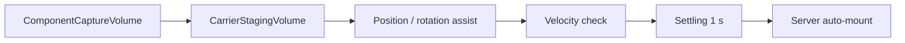
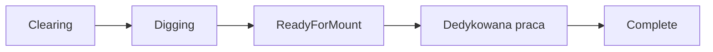

# Budowa mostu

## Status

**Gotowe dla głównego tutorialowego ciągu, z placeholderowym contentem.**
Fundament, przyczółek, dźwigar, belka poprzeczna, stężenie ukośne i panele
mają dedykowane workflow.

## Dane części

### `BridgeComponentSO`

| Pole | Znaczenie |
|---|---|
| `componentName`, `componentSprite` | Nazwa i ikona HUD/fabryki |
| `componentPrefab` | Holder/finalna część mostu |
| `bridgeComponentType` | Ogólna kategoria legacy/UI |
| `componentAdvancementLevel` | Poziom technologiczny; obecnie słabo wykorzystywany |
| `supportedEquippableItemTypeList` | Narzędzia prostego assembly |
| `assemblingProgressNeeded` | Progress prostego montażu |
| `needAssembling` | Czy po mount wymagane jest assembly |
| `constructionWorkflow` | Fundament |
| `abutmentConstructionWorkflow` | Przyczółek |
| `girderConstructionWorkflow` | Dźwigar |
| `crossBeamConstructionWorkflow` | Belka poprzeczna |
| `diagonalBracingConstructionWorkflow` | Stężenie |
| `deckPanelConstructionWorkflow` | Panel |

Przypisuj tylko workflow odpowiadający typowi prefaba. Część bez dedykowanego
workflow zachowuje prosty mount/assembly.

## `GameplayManager`

| Pole | Znaczenie |
|---|---|
| `bridge` | Kontener wszystkich scenowych holderów |
| `bridgeComponentDataArray` | Synchronizowany stan komponentów |
| `bridgeBuildingStages` | Kolejność etapów i wymagane części |
| `currentBridgeBuildingStageIndex` | Stan runtime/initial debug |
| `isFullyAsembled` | Stan ukończenia; nazwa zawiera historyczną literówkę |
| `enableRiverBedResourceRemoval` | Globalnie włącza cleanup `BaseResourceNew` na dnie rzeki |
| `enableUnsupportedWaterDowning` | Włącza downed po timerze braku bezpiecznego podłoża |

Każdy `BridgeComponent` musi mieć unikalny `componentID`, który odpowiada
elementowi stanu. Manager odblokowuje tylko części aktualnego etapu i po
ukończeniu wszystkich wymagań przechodzi dalej. Ukończenie ostatniego etapu
wywołuje victory.

`BridgeComponentNetworkState` przenosi mount/assembly, stage, progress,
dwie wartości całkowite, cztery progresy punktów i dwa pola pomocnicze.
Workflow interpretują te pola inaczej, ale nie zmieniają protokołu.

Podczas `Clearing` dedykowany trigger placu jest miękkim fallbackiem targetowania. Celowanie w pusty plac pokazuje prompt etapu, ale interaktywny albo podatny na obrażenia obiekt za triggerem przejmuje `CurrentTarget`. Po przejściu do `Digging` plac ponownie jest bezpośrednim celem pracy.

## `BridgeComponent`

| Pole | Znaczenie |
|---|---|
| `componentID` | Stabilny, unikalny identyfikator w managerze |
| `isMounted`, `canBeMounted`, `isAssembled` | Stan runtime/synchronizacji |
| `bridgeComponentSO` | Typ oczekiwanej części |
| `readyForMountingVisualsGameObject` | Ghost i trigger interakcji |
| `mountedComponentVisualsGameObject` | Finalny visual |
| `ghostMaterial` | Materiał podglądu |
| `mountedPhysicalColliders` | Collidery aktywowane według workflow |

Collidery ghosta powinny być triggerami. Fizyczne collidery niewidocznej
części są wyłączone. Dedykowane workflow może opóźnić collider aż do
`Complete` albo wyłączyć go po ukończeniu, jak fundament.

## Precyzyjne dostarczanie części

Sześć aktualnych części tutorialowego mostu używa `BridgeMountSocket`. Samo
wejście carriera w zasięg interakcji nie montuje już części. Serwer wymaga
jednocześnie poprawnego typu, aktywnego carry, obecności holderów w staging
volume, właściwej pozycji i rotacji oraz odpowiednio małej prędkości. Poprawny
stan musi utrzymać się przez `settleDuration`, domyślnie `1 s`.

| Pole `BridgeMountSocket` | Znaczenie |
|---|---|
| `targetPose` | Dokładna pozycja i bazowa rotacja montażu |
| `componentCaptureVolume` | Szeroka strefa wykrywania kompatybilnej niesionej części |
| `carrierStagingVolume` | Obszar, w którym muszą znajdować się wszyscy aktywni holderzy |
| `positionTolerance` | Dopuszczalny błąd pozycji w lokalnych osiach targetu; aktualnie `0.40 m` |
| `rotationToleranceDegrees` | Dopuszczalny błąd rotacji per oś; aktualnie `18°` |
| `maximumLinearVelocity` | Maksymalna prędkość podczas settle; aktualnie `0.35 m/s` |
| `maximumAngularVelocityDegrees` | Maksymalna prędkość kątowa; aktualnie `15°/s` |
| `settleDuration` | Czas nieprzerwanego poprawnego ustawienia |
| `requireRecommendedCarrierCount` | Wymaga pełnej docelowej obsady, niezależnie od testowego minimum pickup |
| `allowedOrientationOffsetsEuler` | Alternatywne poprawne orientacje względem `targetPose`, np. obrót `180°` |
| pola `Soft Assist` | Sprężyna, damping i limity przyspieszenia pozycji/rotacji |
| pola `Feedback` | Zasięg, grubość, kolory, skala obrysu i długości wskaźników |

Capture volume sześciu części jest powiększony o około `25%`, a staging volume
o około `20%` w X/Z. Obrys feedbacku skaluje bounds ghosta o `1.12` i dodaje
minimum `0.25 m` marginesu. Strzałki pozycji mogą mieć do `2.5 m`, a promień
wskaźników rotacji skaluje się z rozmiarem części. Runtime visuale nie mają
colliderów i używają `Ignore Raycast`.

Gdy jedna część znajduje się w kilku capture volume, tylko socket o najmniejszym
znormalizowanym błędzie pozycji i rotacji może stosować assist albo rozpocząć
settle. Remis rozstrzyga stabilny `componentID`. Zapobiega to przeciąganiu
jednej części przez sąsiednie sockety.

Legacy Support i Roadway bez `BridgeMountSocket` zachowują ręczny montaż.

## Bazowy `BridgeConstructionSite`

| Pole | Znaczenie |
|---|---|
| `requiresSiteClearing` | Włącza etap oczyszczania |
| `clearingAreaSize` | Rozmiar wizualnego obrysu |
| `clearingObstacles` | Jawna lista zasobów wymagających Axe |
| `constructionInteractionCollider` | Collider routujący prompt/work |
| `markedGroundVisual` | Obrys clearing |
| `diggingVisual` | Visual aktywnego wykopu |
| `completedDigVisual` | Visual gotowego dołu, tylko przed mount |
| `hideMountedVisualsWhenComplete` | Ukrywa finalny visual po ukończeniu |
| `disablePhysicalCollidersWhenComplete` | Wyłącza collider root/final po ukończeniu |

Pusta lista aktywnych przeszkód automatycznie kończy clearing. `CompletedDig`
powinien zniknąć po dostarczeniu fundamentu.

## Workflow

### Fundament

`Clearing -> Digging -> ReadyForMount -> Hammering -> Complete`

`BridgeConstructionWorkflowSO`:

| Pole | Znaczenie |
|---|---|
| `diggingTool` | Zwykle Shovel |
| `diggingProgressNeeded` | Łączny work progress wykopu |

Po mount foundation znika plac i sześcian wykopu. Industrial Hammer dodaje
assembly progress. Końcowy root collider może być wyłączony zgodnie z
ustawieniem stanowiska.

### Przyczółek

`WaitingForFoundation -> ReadyForMount -> Leveling -> Anchoring ->
Backfilling -> Complete`

| Pole workflow | Znaczenie |
|---|---|
| `levelingTool` | Narzędzie klinów |
| `anchoringTool` | Narzędzie czterech kotew |
| `backfillingTool` | Narzędzie zasypania |
| `maximumLevelStep` | Zakres wysokości |
| `initialLevelDifference` | Początkowy przechył |
| `levelStepHeight` | Metry na krok |
| `anchorProgressNeeded` | Progress jednej kotwy |
| `backfillProgressNeeded` | Łączny progress zasypania |

Uderzenie młotem obniża wskazaną, podniesioną stronę. Po zrównaniu aktywują
się cztery kotwy, a potem Backfill Area.

### Dźwigar główny

`WaitingForSupports -> ReadyForMount -> Leveling -> Fastening -> Complete`

| Pole workflow | Znaczenie |
|---|---|
| `levelingTool`, `fasteningTool` | Narzędzia etapów |
| `maximumLevelStep`, `initialLevelDifference` | Zakres i przechył |
| `levelStepHeight` | Metry na krok |
| `fastenerProgressNeeded` | Progress każdego z czterech mocowań |

Placeholder dźwigara ma około 14 m i przekracza tutorialową rzekę. Start/End
Wedge obniża odpowiadający koniec.

### Belka poprzeczna

`WaitingForGirders -> ReadyForMount -> Aligning -> Clamping -> Fastening ->
Complete`

| Pole workflow | Znaczenie |
|---|---|
| `alignmentTool` | Industrial Hammer |
| `clampingTool`, `fasteningTool` | Wrench |
| `maximumAlignmentStep` | Zakres przesunięcia |
| `alignmentStepDistance` | Metry na krok |
| `clampProgressNeeded` | Progress zacisku |
| `maximumClampProgressDifference` | Maksymalna przewaga jednej strony |
| `fastenerProgressNeeded` | Progress mocowania |

MoveLeft odpycha w prawo, MoveRight w lewo. Zaciski trzeba rozwijać
naprzemiennie, potem ukończyć cztery fastenery.

### Stężenie ukośne

`WaitingForCrossBeams -> ReadyForMount -> Aligning -> TemporaryFixing ->
Fastening -> Complete`

| Pole workflow | Znaczenie |
|---|---|
| trzy tool fields | Alignment, temporary fix i final fastening |
| `initialAlignmentOffset` | Początkowa liczba kroków od celu |
| `maximumAlignmentStep` | Zakres kąta |
| `alignmentAngleStep` | Stopnie na krok |
| `temporaryFixProgressNeeded` | Progress każdego końca |
| `fastenerProgressNeeded` | Progress finalnego punktu |

Instancja holdera wybiera orientację `/` albo `\`. `ForwardSlash` ustawia
`MountTargetPose` i ghost na lokalny yaw `+45°`, a `BackSlash` na `-45°`.
Pozycja obu targetów pozostaje wspólna, ponieważ stężenia krzyżują się w tym
samym środku. Dozwolony offset `0/180°` oznacza odpowiednio `45°/225°` oraz
`-45°/135°`. Dzięki temu assist, błąd rotacji i arbitraż nakładających się
socketów odnoszą się do rzeczywistej przekątnej, a nie osi kontenera.

`alignmentStep` nie zmienia targetu dostarczania ani ghosta. Po montażu obraca
wyłącznie finalny `bracingVisualRoot` podczas etapu `Aligning`. Finalne
połączenia mają ścisłą kolejność krzyżową; aktywny punkt powinien pulsować i
zmieniać kolor.

### Panel pomostu

`WaitingForPrevious -> ReadyForMount -> Aligning -> GapSetting -> Fastening
-> Complete`

| Pole workflow | Znaczenie |
|---|---|
| `alignmentTool`, `gapTool`, `fasteningTool` | Narzędzia etapów |
| `initialAlignmentOffset`, `maximumAlignmentStep` | Start i zakres |
| `lateralStepDistance` | Przesunięcie na krok |
| `rotationStepDegrees` | Kąt na krok |
| `minimum/maximumInitialGapStep` | Losowy początkowy gap |
| `gapStepDistance` | Metry na krok szczeliny |
| `fastenerProgressNeeded` | Progress jednego fastenera |

Pierwszy i ostatni panel używają czterech fastenerów, środkowe dwóch. Markery
punktów pracy muszą znajdować się nad visualem panelu.

## `BridgeDeckSection`

| Pole | Znaczenie |
|---|---|
| `sectionLength` | Całkowita długość w metrach |
| `panelGap` | Stała szczelina |
| `nominalPanelLength` | Wartość referencyjna layoutu |
| `prerequisites` | Stężenia wymagane przed pierwszym slotem |
| `panelSlots` | Uporządkowana lista scenowych holderów |

Długość panelu:

`(sectionLength - panelGap * (panelCount - 1)) / panelCount`

Sloty nie są generowane podczas gry. Projektant tworzy je w edytorze, nadaje
unikalne IDs i zachowuje kolejność. Sekcja skaluje layout, ghost, final visual,
collider i punkty pracy.

## Prompty i stage info

Resolver celu daje priorytet aktywnemu work pointowi, potem stanowisku, a na
końcu rootowi `BridgeComponent`. Niewłaściwe narzędzie pokazuje informację
`Equip ...`, ale nie aktywny LMB ani outline.

`BridgeStageInfoManager` może mapować `BridgeComponentSO + Stage` na tytuł i
treść tutorialu. Pierwsza synchronizacja nie odtwarza historii.

## Konfiguracja nowej części

1. Utwórz `BridgeComponentSO`.
2. Utwórz/podepnij odpowiadający workflow SO.
3. Utwórz mountable SO i sieciowy prefab produktu.
4. Utwórz holder z `BridgeComponent`, site oraz work pointami.
5. Dla nowej precyzyjnie dostarczanej części dodaj `BridgeMountSocket`, jawny
   `MountTargetPose`, capture volume i carrier staging volume.
6. Nadaj unikalny `componentID`.
7. Dodaj holder do `Bridge` i właściwego `bridgeBuildingStage`.
8. Skonfiguruj prerequisites.
9. Dodaj produkt do fabryki oraz network registry.
10. Sprawdź ghost, target pose, final visual i collidery w każdym stanie.

## Ograniczenia

- `BridgeComponent` nadal ma niezaimplementowaną ścieżkę oznaczoną
  `NotImplementedException`; wymaga usunięcia albo dokończenia.
- Enum `BridgeComponentType` nie opisuje jeszcze wszystkich nowych rodzajów.
- Network state jest współdzielonym kontenerem pól o znaczeniu zależnym od
  workflow; łatwo wprowadzić kolizję przy nowym typie.
- Filary, oczepy, łożyska, bariery i connectory nie mają pełnej integracji
  aktywnego poziomu.
