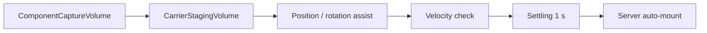
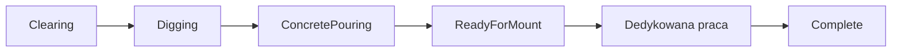

# Budowa mostu

## Status

**Gotowe dla głównego tutorialowego ciągu, z placeholderowym contentem.**
Fundament, przyczółek, dźwigar, belka poprzeczna, stężenie ukośne i panele
mają dedykowane workflow.

## Dane części

### `BridgeComponentSO`

| Pole | Znaczenie |
|---|---|
| `componentName`, `componentSprite` | Nazwa i ikona HUD/fabryki |
| `componentPrefab` | Holder/finalna część mostu |
| `bridgeComponentType` | Ogólna kategoria legacy/UI |
| `componentAdvancementLevel` | Poziom technologiczny; obecnie słabo wykorzystywany |
| `supportedEquippableItemTypeList` | Narzędzia prostego assembly |
| `assemblingProgressNeeded` | Progress prostego montażu |
| `needAssembling` | Czy po mount wymagane jest assembly |
| `constructionWorkflow` | Fundament |
| `abutmentConstructionWorkflow` | Przyczółek |
| `girderConstructionWorkflow` | Dźwigar |
| `crossBeamConstructionWorkflow` | Belka poprzeczna |
| `diagonalBracingConstructionWorkflow` | Stężenie |
| `deckPanelConstructionWorkflow` | Panel |

Przypisuj tylko workflow odpowiadający typowi prefaba. Część bez dedykowanego
workflow zachowuje prosty mount/assembly.

## `GameplayManager`

| Pole | Znaczenie |
|---|---|
| `bridge` | Kontener wszystkich scenowych holderów |
| `bridgeComponentDataArray` | Synchronizowany stan komponentów |
| `bridgeBuildingStages` | Kolejność etapów i wymagane części |
| `currentBridgeBuildingStageIndex` | Stan runtime/initial debug |
| `isFullyAsembled` | Stan ukończenia; nazwa zawiera historyczną literówkę |
| `enableRiverBedResourceRemoval` | Globalnie włącza cleanup `BaseResourceNew` na dnie rzeki |
| `enableUnsupportedWaterDowning` | Włącza downed po timerze braku bezpiecznego podłoża |

Każdy `BridgeComponent` musi mieć unikalny `componentID`, który odpowiada
elementowi stanu. Manager odblokowuje tylko części aktualnego etapu i po
ukończeniu wszystkich wymagań przechodzi dalej. Ukończenie ostatniego etapu
wywołuje victory.

`BridgeComponentNetworkState` przenosi mount/assembly, stage, progress,
dwie wartości całkowite, cztery progresy punktów i dwa pola pomocnicze.
Workflow interpretują te pola inaczej, ale nie zmieniają protokołu.

Podczas `Clearing` dedykowany trigger placu jest miękkim fallbackiem targetowania. Celowanie w pusty plac pokazuje prompt etapu, ale interaktywny albo podatny na obrażenia obiekt za triggerem przejmuje `CurrentTarget`. Po przejściu do `Digging` plac ponownie jest bezpośrednim celem pracy.

## `BridgeComponent`

| Pole | Znaczenie |
|---|---|
| `componentID` | Stabilny, unikalny identyfikator w managerze |
| `isMounted`, `canBeMounted`, `isAssembled` | Stan runtime/synchronizacji |
| `bridgeComponentSO` | Typ oczekiwanej części |
| `readyForMountingVisualsGameObject` | Ghost i trigger interakcji |
| `mountedComponentVisualsGameObject` | Finalny visual |
| `ghostMaterial` | Materiał podglądu |
| `mountedPhysicalColliders` | Collidery aktywowane według workflow |

Collidery ghosta powinny być triggerami. Fizyczne collidery niewidocznej
części są wyłączone. Dedykowane workflow może opóźnić collider aż do
`Complete` albo wyłączyć go po ukończeniu, jak fundament.

## Precyzyjne dostarczanie części

Sześć aktualnych części tutorialowego mostu używa `BridgeMountSocket`. Samo
wejście carriera w zasięg interakcji nie montuje już części. Serwer wymaga
jednocześnie poprawnego typu, aktywnego carry, obecności holderów w staging
volume, właściwej pozycji i rotacji oraz odpowiednio małej prędkości. Poprawny
stan musi utrzymać się przez `settleDuration`, domyślnie `1 s`.

| Pole `BridgeMountSocket` | Znaczenie |
|---|---|
| `targetPose` | Dokładna pozycja i bazowa rotacja montażu |
| `componentCaptureVolume` | Szeroka strefa wykrywania kompatybilnej niesionej części |
| `carrierStagingVolume` | Obszar, w którym muszą znajdować się wszyscy aktywni holderzy |
| `positionTolerance` | Dopuszczalny błąd pozycji w lokalnych osiach targetu; aktualnie `0.40 m` |
| `rotationToleranceDegrees` | Dopuszczalny błąd rotacji per oś; aktualnie `18°` |
| `maximumLinearVelocity` | Maksymalna prędkość podczas settle; aktualnie `0.35 m/s` |
| `maximumAngularVelocityDegrees` | Maksymalna prędkość kątowa; aktualnie `15°/s` |
| `settleDuration` | Czas nieprzerwanego poprawnego ustawienia |
| `requireRecommendedCarrierCount` | Wymaga pełnej docelowej obsady, niezależnie od testowego minimum pickup |
| `allowedOrientationOffsetsEuler` | Alternatywne poprawne orientacje względem `targetPose`, np. obrót `180°` |
| pola `Soft Assist` | Sprężyna, damping i limity przyspieszenia pozycji/rotacji |
| pola `Feedback` | Zasięg, grubość, kolory, skala obrysu i długości wskaźników |

Capture volume sześciu części jest powiększony o około `25%`, a staging volume
o około `20%` w X/Z. Obrys feedbacku skaluje bounds ghosta o `1.12` i dodaje
minimum `0.25 m` marginesu. Strzałki pozycji mogą mieć do `2.5 m`, a promień
wskaźników rotacji skaluje się z rozmiarem części. Runtime visuale nie mają
colliderów i używają `Ignore Raycast`.

Gdy jedna część znajduje się w kilku capture volume, tylko socket o najmniejszym
znormalizowanym błędzie pozycji i rotacji może stosować assist albo rozpocząć
settle. Remis rozstrzyga stabilny `componentID`. Zapobiega to przeciąganiu
jednej części przez sąsiednie sockety.

Legacy Support i Roadway bez `BridgeMountSocket` zachowują ręczny montaż.

## Bazowy `BridgeConstructionSite`

| Pole | Znaczenie |
|---|---|
| `requiresSiteClearing` | Włącza etap oczyszczania |
| `clearingAreaSize` | Rozmiar wizualnego obrysu |
| `clearingObstacles` | Jawna lista zasobów wymagających Axe |
| `constructionInteractionCollider` | Collider routujący prompt/work |
| `markedGroundVisual` | Obrys clearing |
| `diggingVisual` | Visual aktywnego wykopu |
| `completedDigVisual` | Visual gotowego dołu, tylko przed mount |
| `hideMountedVisualsWhenComplete` | Ukrywa finalny visual po ukończeniu |
| `disablePhysicalCollidersWhenComplete` | Wyłącza collider root/final po ukończeniu |

Pusta lista aktywnych przeszkód automatycznie kończy clearing. `CompletedDig`
powinien zniknąć po dostarczeniu fundamentu.

## Workflow

### Fundament

`Clearing -> Digging -> ConcretePouring -> ReadyForMount -> Hammering -> Complete`

Gotowa partia jest transportowana zadokowaną taczką i wylewana przez dwóch
graczy. Poprawne wlanie uruchamia schnięcie, a po jego zakończeniu fundament
przechodzi do `ReadyForMount`. Krytyczna porażka pozostaje logicznie w
`ConcretePouring`; jej przebieg opisuje osobny `FoundationConcreteFailureState`.

### Cykliczne kopanie fundamentu

`Digging` fundamentu zawiera trzy cykle `Loosening -> SoilRemoval`. W każdym cyklu łopata musi nabić `60` work progress, po czym wiadrem trzeba usunąć netto `6` porcji ziemi. Cele kumulacyjne wynoszą `6`, `12` i `18`; ukończenie trzeciego cyklu przełącza plac na `ConcretePouring`.

`SoilRemoval` ma limit czasu ustawiany przez `loosenedSoilHardeningDuration` (tutorial: `15 s`). Deadline rozpoczyna się przy wejściu w podetap i nie jest resetowany przez nabieranie ani zwracanie ziemi. Po upływie czasu plac wraca do `Loosening` z progresem `0`, zachowując liczbę usuniętych porcji i głębokość wykopu. Ponowne rozdrobnienie uruchamia świeży deadline; prompt pokazuje czas pozostały do stwardnienia.

Stan nie zwiększa rozmiaru pakietu mostu: `constructionValueA/B` przechowują indeks cyklu i `FoundationDiggingSubstage`, `constructionProgress` progres łopaty, `constructionAux0` liczbę usuniętych porcji, a `constructionAux1` deadline stwardnienia w czasie serwera. Late join odtwarza podetap, głębokość oraz pozostały czas.

Wykop ma ruchomą powierzchnię ziemi, stałe ściany, dno i łagodną rampę. Głębokość wynosi `1.2 * removedSoilUnits / 18`, maksymalnie `1.2 m`. Zwrócona ziemia podnosi powierzchnię. `EarthPile` wrzucony podczas `ConcretePouring` albo przed montażem przywraca ostatni `SoilRemoval`. Po zamontowaniu fundamentu regres jest wyłączony.

### Przygotowanie betonu

Jedna wspólna betoniarka przy Blast Furnace przyjmuje dokładnie `6 Water`,
`6 Gravel` i `1 Cement Bag`. Pełne wiadro przekazuje trzy porcje po ukończonym
przytrzymaniu RMB, a niesiony worek cementu wkłada się przez E. Bęben mieści
`15` jednostek objętości; wiadro i worek zajmują po `3`.

Korba jest blokowana dla jednego operatora. UI z oporem zlicza sześć pełnych
obrotów zgodnie z ruchem wskazówek zegara, a częściowy progres pozostaje po
zmianie operatora. Mieszanie zaczyna naliczać progres od `6/15` objętości;
każdy kolejny pełny ładunek podnosi maksymalny progres o `20%`. Input na
aktualnym limicie nadal obraca korbę i bęben, ale nie zwiększa progresu ani nie
jest kolejkowany. Dokładny wsad daje `ConcreteReady`, pozostałe kombinacje
kończą jako `RuinedMix`. Przełączenie dźwigni na `Pouring` zwalnia operatora,
obraca bęben i bezpowrotnie opróżnia dowolną zawartość. Gotowy beton jest
ładowany do zadokowanej taczki i może zostać przypisany do konkretnego
fundamentu dopiero przez minigrę wylewania przy wykopie.

`BridgeConstructionWorkflowSO`:

| Pole | Znaczenie |
|---|---|
| `diggingTool` | Zwykle Shovel |
| `diggingProgressNeeded` | Łączny work progress wykopu |
| `diggingCycleCount` | Liczba par `Loosening/SoilRemoval`; tutorial: `3` |
| `looseningProgressPerCycle` | Work progress łopatą w jednym cyklu; tutorial: `60` |
| `soilUnitsPerCycle` | Porcje ziemi do usunięcia netto w cyklu; tutorial: `6` |
| `finalExcavationDepth` | Finalna głębokość fizycznej powierzchni; tutorial: `1.2 m` |
| `loosenedSoilHardeningDuration` | Czas do ponownego stwardnienia podczas `SoilRemoval`; tutorial: `15 s` |

Po mount foundation znika plac i sześcian wykopu. Industrial Hammer dodaje
assembly progress. Końcowy root collider może być wyłączony zgodnie z
ustawieniem stanowiska.

### Przyczółek

`WaitingForFoundation -> ReadyForMount -> Leveling -> Anchoring ->
Backfilling -> Complete`

| Pole workflow | Znaczenie |
|---|---|
| `levelingTool` | Narzędzie klinów |
| `anchoringTool` | Narzędzie czterech kotew |
| `backfillingTool` | Narzędzie zasypania |
| `maximumLogicalTilt` | Granica obu osi logicznych; tutorial: `8` |
| `minimumInitialTiltMagnitude` | Najmniejsza wartość losowana na początku; tutorial: `1` |
| `levelingSuccessTolerance` | Tolerancja zatwierdzenia; tutorial: dokładnie `0` |
| `visuallyStraightTiltRange` | Zakres ukrywany przez visual; tutorial: `-4...4` |
| `maximumVisualTiltDegrees` | Maksymalny pitch/roll części; tutorial: `3°` |
| `anchorProgressNeeded` | Progress jednej kotwy |
| `backfillProgressNeeded` | Łączny progress zasypania |

Poziomowanie ma niezależne osie długości i szerokości. Cztery kliny zmieniają
odpowiednią podpisaną wartość o jeden krok i pozwalają przestrzelić zero.
Prompty nie ujawniają wartości ani kierunku korekty. Odczyt wykonuje dwuslotowa
poziomica `SpiritLevel`: LPM przy jednej z czterech stref przykłada narzędzie i
pokazuje daną oś. Długość jest dostępna z przodu i z tyłu, a szerokość z lewej
i prawej strony. Lokalne cyjanowe obrysy widzi wyłącznie gracz z wyposażoną
poziomicą. Posiadacz Industrial Hammera widzi zamiast nich cztery pomarańczowe
cele wskazujące aktywne kliny; znaczniki nie ujawniają kierunku korekty.
Po ustawieniu `0/0` dowolny gracz zatwierdza wynik
przez E na części albo punkcie. Błędne zatwierdzenie losuje ponownie tylko
niepoprawne osie; poprawna oś pozostaje na zerze.

### Dźwigar główny

`WaitingForSupports -> ReadyForMount -> Leveling -> Fastening -> Complete`

| Pole workflow | Znaczenie |
|---|---|
| `levelingTool`, `fasteningTool` | Narzędzia etapów |
| pola logicznego/visualnego przechyłu | Te same dwie osie i ograniczony visual co przyczółek |
| `fastenerProgressNeeded` | Progress każdego z czterech mocowań |

Placeholder dźwigara ma około 14 m i przekracza tutorialową rzekę. Punkty
Start/End regulują długość, a Left/Right szerokość. Zakres `-4...4` wygląda
prosto, dlatego wiarygodne ustawienie wymaga pomiaru poziomicą i osobnego
zatwierdzenia E. Dopiero poprawne zatwierdzenie przechodzi do `Fastening`.

### Belka poprzeczna

`WaitingForGirders -> ReadyForMount -> Aligning -> Clamping -> Fastening ->
Complete`

| Pole workflow | Znaczenie |
|---|---|
| `alignmentTool` | Industrial Hammer |
| `clampingTool`, `fasteningTool` | Wrench |
| `maximumAlignmentStep` | Zakres przesunięcia |
| `alignmentStepDistance` | Metry na krok |
| `clampProgressNeeded` | Progress zacisku |
| `maximumClampProgressDifference` | Maksymalna przewaga jednej strony |
| `fastenerProgressNeeded` | Progress mocowania |

MoveLeft odpycha w prawo, MoveRight w lewo. Zaciski trzeba rozwijać
naprzemiennie, potem ukończyć cztery fastenery.

### Stężenie ukośne

`WaitingForCrossBeams -> ReadyForMount -> Aligning -> TemporaryFixing ->
Fastening -> Complete`

| Pole workflow | Znaczenie |
|---|---|
| trzy tool fields | Alignment, temporary fix i final fastening |
| `initialAlignmentOffset` | Początkowa liczba kroków od celu |
| `maximumAlignmentStep` | Zakres kąta |
| `alignmentAngleStep` | Stopnie na krok |
| `temporaryFixProgressNeeded` | Progress każdego końca |
| `fastenerProgressNeeded` | Progress finalnego punktu |

Instancja holdera wybiera orientację `/` albo `\`. `ForwardSlash` ustawia
`MountTargetPose` i ghost na lokalny yaw `+45°`, a `BackSlash` na `-45°`.
Pozycja obu targetów pozostaje wspólna, ponieważ stężenia krzyżują się w tym
samym środku. Dozwolony offset `0/180°` oznacza odpowiednio `45°/225°` oraz
`-45°/135°`. Dzięki temu assist, błąd rotacji i arbitraż nakładających się
socketów odnoszą się do rzeczywistej przekątnej, a nie osi kontenera.

`alignmentStep` nie zmienia targetu dostarczania ani ghosta. Po montażu obraca
wyłącznie finalny `bracingVisualRoot` podczas etapu `Aligning`. Finalne
połączenia mają ścisłą kolejność krzyżową; aktywny punkt powinien pulsować i
zmieniać kolor.

### Panel pomostu

`WaitingForPrevious -> ReadyForMount -> Aligning -> GapSetting -> Fastening
-> Complete`

| Pole workflow | Znaczenie |
|---|---|
| `alignmentTool`, `gapTool`, `fasteningTool` | Narzędzia etapów |
| `initialAlignmentOffset`, `maximumAlignmentStep` | Start i zakres |
| `lateralStepDistance` | Przesunięcie na krok |
| `rotationStepDegrees` | Kąt na krok |
| `minimum/maximumInitialGapStep` | Losowy początkowy gap |
| `gapStepDistance` | Metry na krok szczeliny |
| `fastenerProgressNeeded` | Progress jednego fastenera |

Pierwszy i ostatni panel używają czterech fastenerów, środkowe dwóch. Markery
punktów pracy muszą znajdować się nad visualem panelu.

## `BridgeDeckSection`

| Pole | Znaczenie |
|---|---|
| `sectionLength` | Całkowita długość w metrach |
| `panelGap` | Stała szczelina |
| `nominalPanelLength` | Wartość referencyjna layoutu |
| `prerequisites` | Stężenia wymagane przed pierwszym slotem |
| `panelSlots` | Uporządkowana lista scenowych holderów |

Długość panelu:

`(sectionLength - panelGap * (panelCount - 1)) / panelCount`

Sloty nie są generowane podczas gry. Projektant tworzy je w edytorze, nadaje
unikalne IDs i zachowuje kolejność. Sekcja skaluje layout, ghost, final visual,
collider i punkty pracy.

## Prompty i stage info

Resolver celu daje priorytet aktywnemu work pointowi, potem stanowisku, a na
końcu rootowi `BridgeComponent`. Niewłaściwe narzędzie pokazuje informację
`Equip ...`, ale nie aktywny LMB ani outline.

`BridgeStageInfoManager` może mapować `BridgeComponentSO + Stage` na tytuł i
treść tutorialu. Pierwsza synchronizacja nie odtwarza historii.

## Konfiguracja nowej części

1. Utwórz `BridgeComponentSO`.
2. Utwórz/podepnij odpowiadający workflow SO.
3. Utwórz mountable SO i sieciowy prefab produktu.
4. Utwórz holder z `BridgeComponent`, site oraz work pointami.
5. Dla nowej precyzyjnie dostarczanej części dodaj `BridgeMountSocket`, jawny
   `MountTargetPose`, capture volume i carrier staging volume.
6. Nadaj unikalny `componentID`.
7. Dodaj holder do `Bridge` i właściwego `bridgeBuildingStage`.
8. Skonfiguruj prerequisites.
9. Dodaj produkt do fabryki oraz network registry.
10. Sprawdź ghost, target pose, final visual i collidery w każdym stanie.

## Betonowanie fundamentu

Po trzecim cyklu kopania fundament przechodzi do `ConcretePouring`. Jedna
gotowa partia betonu musi zostać przewieziona zadokowaną taczką. Przy wykopie
dwóch graczy zajmuje stanowiska przy rączkach i przesuwa kursory ku górze.
Różnica do `0.15` pozwala przechylać taczkę. Przerwanie minigry zachowuje
beton. Różnica ponad `0.35` utrzymana przez `0.6 s` uruchamia krytyczną
sekwencję porażki, a nie tylko zniszczenie ładunku.

Po poprawnym wylaniu `BridgeConstructionSite.TryAcceptConcreteLoad()` zapisuje
ładunek w `constructionAnchor0` i przechodzi do `ConcreteDrying`. Deadline
schnięcia jest zapisany w `constructionAux1`; tutorial używa `1` partii i
`30 s`. Po wyschnięciu aktywowany jest collider powierzchni i etap
`ReadyForMount`. Ziemia nie może już cofnąć wykopu po przyjęciu betonu.

### Krytyczna porażka wylewania

Krytyczna porażka nie zmienia `BridgeConstructionStage.ConcretePouring`.
Serwer prowadzi jej przebieg w podstanie `FoundationConcreteFailureState`:
`CriticalSequence -> HardenedFailure -> Collapsing ->
AwaitingWheelbarrowExit`. Dzięki temu właściwy etap budowy pozostaje stabilny,
a late join może odtworzyć dokładną fazę awarii.

Wejście w `CriticalSequence` uwalnia obu uczestników minigry oraz ewentualnego
pasażera taczki, zużywa cały beton i natychmiast pokazuje twardą, pełną taflę.
Taczka wykonuje kontrolowany lot do pozycji `TrappedInFailedConcrete`, gdzie
pozostaje zablokowana i nieużywalna.

Twardą taflę można rozbić wyłącznie kilofem. Wszystkie trafienia składają się
na jeden serwerowy progres `0–100`, a trzy progi progresu przełączają kolejne
etapy wizualnych pęknięć. Po osiągnięciu `100` rozpoczyna się `Collapsing`.
Taczka spada wtedy swobodnie, bez dodatkowego impulsu.

Po rozpadzie fundament przechodzi do `AwaitingWheelbarrowExit` i nadal nie
przyjmuje kolejnej partii. Oczekuje, aż ta sama uwięziona taczka opuści
dedykowany recovery volume. Dopiero po jej wyprowadzeniu stan awarii jest
czyszczony i można ponowić wylewanie.

### NavMesh wokół wykopu i awarii

Każdy fundament używa bake-only proxy oraz lokalnego `NavMeshSurface` dla
wykopu. `NavMeshObstacle` z carvingiem zakrywa otwarty wykop i mokry beton.
Jest wyłączany dla twardej tafli, aby NPC mogli po niej przejść, lecz wraca
przed rozpoczęciem rozpadu, zanim powierzchnia przestanie być bezpieczna.

Scenową konfigurację obu fundamentów tworzy `WheelbarrowSetup`.
`FoundationConcreteFailureProbe` weryfikuje oba fundamenty, ich wiring i
serializację, collider tafli, trzy crack visuals oraz elementy NavMesh.

## Ograniczenia

- `BridgeComponent` nadal ma niezaimplementowaną ścieżkę oznaczoną
  `NotImplementedException`; wymaga usunięcia albo dokończenia.
- Enum `BridgeComponentType` nie opisuje jeszcze wszystkich nowych rodzajów.
- Network state jest współdzielonym kontenerem pól o znaczeniu zależnym od
  workflow; łatwo wprowadzić kolizję przy nowym typie.
- Filary, oczepy, łożyska, bariery i connectory nie mają pełnej integracji
  aktywnego poziomu.
