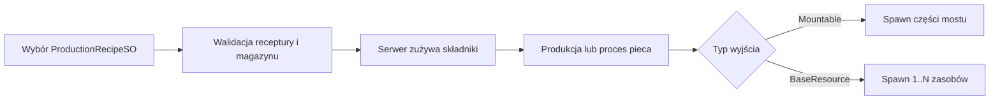

# Fabryki, magazyny i produkcja

## Status

**Gotowe dla aktywnego contentu.** Wspólnym źródłem prawdy dla produkcji jest
`ProductionRecipeSO`. Carpenter Table produkuje części mostu, a Blast Furnace
produkuje zasoby. Wybór receptury, zużycie składników i spawn produktów są
autorytatywne po stronie serwera.

## `BaseStorageNew`

Magazyn przechowuje ilości według dokładnej referencji `BaseResourceSO`.
Interakcja gracza może odłożyć trzymany zasób albo wycofać egzemplarz.

| Pole | Znaczenie |
|---|---|
| `storableBaseResourcesSOList` | Whitelist zasobów przyjmowanych przez magazyn |
| `withdrawSpawnPoint` | Miejsce tworzenia wycofanego zasobu |
| `withdrawSpawnFallbackOffset` | Lokalny fallback, gdy punkt nie jest przypisany |

Stan ilości jest sieciowy. `BaseResourceAmountChanged` odświeża UI oraz fabryki.
Prefab wycofywanego zasobu musi być zarejestrowany jako NetworkPrefab.

Fabryka automatycznie rozszerza whitelistę magazynu o wejścia wszystkich swoich
receptur. Dla receptury produkującej `BaseResourceSO` dodaje również jej produkt,
dzięki czemu piec może przechowywać wytworzone półprodukty.

## `MainStorageNew`

Główny magazyn mostu przyjmuje gotowe `MountableBridgeComponent`.

| Pole | Znaczenie |
|---|---|
| `allRequiredResourcesStored` | Stan runtime ukończenia wymagań |
| `requiredBridgeComponents` | Lista `BridgeComponentSO` i wymaganych ilości |

`BridgeComponentStored` informuje `GameplayManager` i UI o zmianie. Lista ta nie
jest katalogiem produkcji fabryki.

## `ProductionRecipeSO`

Asset tworzy się z menu `Create > Scriptable Objects > Production Recipe`.

| Pole | Znaczenie |
|---|---|
| `recipeName` | Nazwa wyświetlana w UI fabryki |
| `recipeIcon` | Ikona listy i wybranego produktu |
| `requiredResources` | Lista `BaseResourceSO + amount` zużywana przy starcie |
| `productType` | `MountableBridgeComponent` albo `BaseResource` |
| `mountableBridgeComponentOutput` | Wyjście używane dla części mostu |
| `baseResourceOutput` | Wyjście używane dla zwykłego zasobu |
| `outputAmount` | Liczba produktów; kod wymusza minimum `1` |
| `meltingPoint` | Temperatura, od której piec nalicza właściwy progress |
| `combustionTemperature` | Temperatura, od której materiał zaczyna się przepalać |
| `neededProgress` | Wymagany progress prawidłowej obróbki |
| `neededCombustionProgress` | Limit progressu przegrzania przed zniszczeniem wsadu |

Tylko pole wyjścia zgodne z `productType` powinno być przypisane. `HasValidOutput`
pozwala fabryce odrzucić niekompletną recepturę przed zużyciem składników.
Parametry pieca są ignorowane przez Carpenter Table.

## Wspólny flow fabryki

### `BaseFactory`

| Pole | Znaczenie |
|---|---|
| `factoryInteractionUI` | Panel wyboru i statusu |
| `InteractionOutlineGameobject` | Visual legacy; nie jest nowym systemem outline |
| `productionRecipeSOArray` | Aktywny katalog receptur danej instancji/poziomu |
| `currentlySelectedProductionRecipeSO` | Startowa i diagnostyczna referencja wyboru |
| `mountableBridgeComponentSOArray` | Pole kompatybilności legacy; nie jest źródłem prawdy |
| `currentlySelectedMountableBridgeComponentSO` | Widok kompatybilności dla starszego kodu |
| `baseStorageNew` | Magazyn wejściowy |
| `mountableBridgeComponentSpawnPoint` | Wspólny punkt spawnu obu typów produktów |
| `bridgeComponentSpriteRenderer` | World-space podgląd ikony receptury |
| `productionDuration` | Czas standardowej produkcji poza procesem pieca |
| `defaultSelectedComponentIndex` | Początkowy indeks; `-1` oznacza brak wyboru |

Serwer waliduje indeks, typ wyjścia, komplet składników, brak aktywnej produkcji
i prefab produktu. Zużycie składników ma rollback, jeśli nie może zostać
dokończone.

Wyjście `BaseResourceSO` jest spawnowane przez `BaseResourceSpawnUtility`.
Produkty partii są rozstawiane wokół spawn pointu z odstępem około `0.7 m`.
Losowanie i spawn odbywają się tylko na serwerze.

## Carpenter Table

`CarpenterTableFactory` akceptuje receptury z wyjściem
`MountableBridgeComponentSO` i dodatkowo sprawdza długość oraz szerokość.

| Pole | Znaczenie |
|---|---|
| `tableSwitch` | Fizyczne uruchomienie produkcji |
| `dimensionCranks` | Width i Length; niezależne blokady użytkownika |
| `carpenterTableMinigame` | Opcjonalne zadanie produkcyjne |
| `dimensionInteractionDistance` | Serwerowa walidacja użycia korby |
| `componentLengthMin/Max` | Zakres długości |
| `componentLenghtStep` | Zmiana długości na krok; nazwa ma historyczną literówkę |
| `componentWidthMin/Max` | Zakres szerokości |
| `componentWidthStep` | Zmiana szerokości na krok |

Wartość wymiaru ma postać `min + index * step`. Produkcja jest dostępna, gdy
ustawienia odpowiadają `MountableBridgeComponentSO` wskazanemu przez recepturę.

### Korby i dial UI

`CarpenterDimensionCrank` wskazuje fabrykę, wymiar, obracany visual, oś obrotu
i `degreesPerStep` (zwykle 30 stopni). `CarpenterDimensionDialUI` zapewnia
lokalny płynny drag, ale wysyła request dopiero po zmianie dyskretnego indeksu.
Zamknięcie panelu zwalnia blokadę i nie cofa zatwierdzonych zmian.

### Katalog tutorialowy i koszty

| Kolejność | Receptura |
|---:|---|
| 1 | Wooden Foundation: 4 Log + 3 Board + 1 Foundation Anchor Kit |
| 2 | Wooden Abutment: 4 Log + 3 Board + 1 Connector Plate Set |
| 3 | Wooden Main Girder: 2 Log + 1 Board + 1 Connector Plate Set |
| 4 | Wooden Cross Beam: 1 Log + 1 Board + 1 Bolt & Nut Set |
| 5 | Wooden Diagonal Bracing: 1 Log + 1 Board + 1 Bolt & Nut Set |
| 6 | Wooden Deck Panel: 3 Board + 1 Forged Nail Bundle |

To override instancji w `Tutorial_scene`. `FPP_scene` używa osobnych receptur
legacy dla Basic Support i Basic Roadway.

## Blast Furnace

`BlastFurnaceFactory` akceptuje receptury z wyjściem `BaseResourceSO`.
`FurnaceStorage` pobiera parametry procesu z aktualnego `ProductionRecipeSO`,
nie z `MountableBridgeComponentSO`.

| Receptura | Wejście | Wyjście | Temperatura | Progress |
|---|---:|---:|---:|---:|
| Forged Nail Bundle | 1 Iron Nugget | 3 | 650 | 400 |
| Bolt & Nut Set | 1 Iron Nugget | 2 | 750 | 550 |
| Connector Plate Set | 1 Iron Nugget | 2 | 850 | 700 |
| Foundation Anchor Kit | 1 Iron Nugget | 2 | 900 | 800 |
| Cement Bag | 2 Limestone Stone + 2 Clay Lump | 1 | 700 | 450 |

Progi spalania wynoszą odpowiednio `900`, `950`, `1000` i `1050`, a wymagany
progress spalania `900`, `950`, `1000` i `1100`. Wraz z trudniejszym produktem
rośnie wymagana temperatura, a margines do przegrzania maleje.

`Cement Bag` używa temperatury spalania `900` i wymaganego progressu spalania
`900`. Limestone Vein wymaga trzech trafień kilofem, Clay Deposit trzech trafień
łopatą; oba złoża tworzą po jednym przenośnym składniku i są odnawiane przez
`ResourcePopulationZone`.

## Concrete Mixer

`ConcreteMixerController` jest statycznym, sieciowym odbiornikiem substancji i
niesionego cementu. Stan partii (`Empty`, `Loading`, `Mixing`, `ConcreteReady`,
`RuinedMix`), tryb bębna, skład, progres korby i operator są autorytatywne po
stronie serwera. Late join odtwarza cały snapshot z `NetworkVariable`.

Profil tutorialowy wymaga `6 Water + 6 Gravel + 1 Cement Bag`, sześciu obrotów
i ma pojemność `15`. Progres jest ograniczony przez zapełnienie bębna: poniżej
`6/15` nie rośnie, a każdy pełny ładunek `3` zwiększa limit o `20%`. Błędny,
pełny wsad może dojść do `100%` i zakończyć się jako `RuinedMix`. Załadowanie
może trwać podczas pracy korby. Osiągnięcie aktualnego limitu nie blokuje
kręcenia korbą ani obrotu bębna; nadmiarowe obroty nie zwiększają progresu i
nie są odkładane do zaliczenia po dodaniu kolejnych składników. Dźwignia
`Mixing/Pouring` opróżnia całość po krótkiej animacji; V1 nie tworzy jeszcze
transportowalnego betonu.

Paliwo pozostaje niezależne od składników receptury. `FurnaceStorage` zużywa
wyłącznie zasoby z `BaseResourceSO.furnaceFuelAmount > 0`, więc Iron Nugget ani
metalowy produkt nie mogą zostać przypadkowo potraktowane jako paliwo.

### Metalowe półprodukty

`Forged Nail Bundle`, `Bolt & Nut Set`, `Connector Plate Set` i
`Foundation Anchor Kit` są dynamicznymi zasobami single-carry. Nie mają
receptur niszczenia ani wartości paliwowej. Ich placeholderowe prefaby są
NetworkPrefabami i można je fizycznie przenieść z pieca do Carpenter Table.

### `BlastFurnaceMinigame`

Minigame prezentuje temperaturę, wartość wymaganą, strefę idealną i krytyczną
oraz czasy ukończenia/porażki. W klasie nadal znajduje się
`NotImplementedException`, dlatego minigame jest **częściowy**, mimo że bazowy
flow temperatury, paliwa, postępu, przegrzania i spawnu produktów działa.

## UI fabryk

`FactoryInteractionUI` i jego child components pokazują:

- katalog `ProductionRecipeSO`;
- nazwę, ikonę i wielkość partii;
- wymagane składniki oraz stan storage;
- wymiary Carpenter Table;
- temperaturę, wymagany progress i stan pieca;
- production progress oraz failure reason.

UI odświeża się z eventów fabryki. Nie zmienia bezpośrednio magazynu ani stanu
produkcji.

## Dodawanie receptury

1. Utwórz `ProductionRecipeSO`.
2. Wybierz właściwy `productType` i przypisz dokładnie jedno wyjście.
3. Dodaj `requiredResources` i ustaw `outputAmount`.
4. Dla pieca skonfiguruj temperatury i oba wymagane progresy.
5. Dodaj recepturę do `productionRecipeSOArray` właściwej instancji fabryki.
6. Sprawdź automatycznie rozszerzoną whitelistę storage.
7. Upewnij się, że prefab wyjścia jest przypisany w SO i zarejestrowany.
8. Dla Carpenter Table ustaw osiągalne Width/Length.
9. Przetestuj hosta i klienta, w tym brak podwójnego spawnu.

## Wyjście betoniarki

`ConcreteMixerController` przekazuje `ConcreteReady` przez
`IConcreteBatchReceiver` wyłącznie do pustej taczki zadokowanej w
`MixerLoading`. Jedna partia dodaje `80 kg`. Zasoby w skrzyni blokują załadunek
betonu. Jeśli nie ma odbiornika, wsad jest błędny albo taczka jest zajęta,
dźwignia zachowuje dotychczasowy flow rozlania i resetu bębna.

## Ograniczenia

- Pola receptury i parametrów pieca w `MountableBridgeComponentSO` pozostają
  tymczasowo dla kompatybilności, ale fabryki nie używają ich jako źródła prawdy.
- Stare `DimensionChangeSwitch` pozostają w kodzie, lecz aktualny flow używa korb.
- Katalogi scenowe można utracić przez przypadkowy `Revert Override`.
- Minigry Carpenter/Furnace wymagają dokończenia przed uznaniem ich za finalne.
