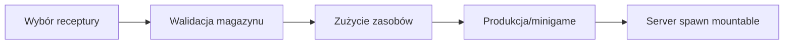

# Fabryki, magazyny i produkcja

## Status

**Gotowe dla aktywnego contentu.** Fabryki i magazyny są synchronizowane przez
serwer. Tutorial używa scenowego override'u katalogu Carpenter Table.

## `BaseStorageNew`

Magazyn przechowuje ilości według dokładnej referencji `BaseResourceSO`.
Interakcja gracza może odłożyć trzymany zasób albo wycofać egzemplarz.

| Pole | Znaczenie |
|---|---|
| `storableBaseResourcesSOList` | Whitelist zasobów przyjmowanych przez magazyn |
| `withdrawSpawnPoint` | Miejsce tworzenia wycofanego zasobu |
| `withdrawSpawnFallbackOffset` | Lokalny fallback, gdy punkt nie jest przypisany |

Stan ilości jest sieciowy. `BaseResourceAmountChanged` odświeża UI oraz systemy
fabryk. Prefab zasobu wycofywanego z magazynu musi być sieciowo zarejestrowany.

## `MainStorageNew`

Główny magazyn mostu przyjmuje gotowe `MountableBridgeComponent`.

| Pole | Znaczenie |
|---|---|
| `allRequiredResourcesStored` | Stan runtime ukończenia wymagań |
| `requiredBridgeComponents` | Lista `BridgeComponentSO` i wymaganych ilości |

`BridgeComponentStored` informuje `GameplayManager`/UI o zmianie. Nie należy
mieszać tej listy z katalogiem produkcji fabryki.

## Wspólny flow fabryki

### `BaseFactory`

| Pole | Znaczenie |
|---|---|
| `factoryInteractionUI` | Panel wyboru i statusu |
| `InteractionOutlineGameobject` | Tymczasowy visual interakcji; pole legacy |
| `mountableBridgeComponentSOArray` | Katalog dostępny w danej fabryce/poziomie |
| `currentlySelectedMountableBridgeComponentSO` | Stan początkowy/runtime |
| `baseStorageNew` | Magazyn wejściowy |
| `mountableBridgeComponentSpawnPoint` | Miejsce produktu |
| `bridgeComponentSpriteRenderer` | World-space podgląd receptury |
| `productionDuration` | Czas standardowej produkcji |
| `defaultSelectedComponentIndex` | Pozycja wybrana po inicjalizacji; `-1` oznacza brak |

Serwer waliduje indeks, zasoby, brak aktywnej produkcji i prefab produktu.
UI klienta nie może samodzielnie zużyć zasobów ani zespawnować części.

## Carpenter Table

`CarpenterTableFactory` dodaje sprawdzenie długości i szerokości.

| Pole | Znaczenie |
|---|---|
| `tableSwitch` | Fizyczne uruchomienie produkcji |
| `dimensionCranks` | Width i Length; każda ma niezależną blokadę użytkownika |
| `carpenterTableMinigame` | Opcjonalne zadanie produkcyjne |
| `dimensionInteractionDistance` | Serwerowa walidacja użycia korby |
| `componentLengthMin/Max` | Zakres długości |
| `componentLenghtStep` | Zmiana długości na krok; nazwa zawiera historyczną literówkę |
| `componentWidthMin/Max` | Zakres szerokości |
| `componentWidthStep` | Zmiana szerokości na krok |

Wartość ma postać `min + index * step`. Produkcja jest możliwa, gdy ustawione
wymiary odpowiadają wybranemu `MountableBridgeComponentSO`.

### `CarpenterDimensionCrank`

| Pole | Znaczenie |
|---|---|
| `factory` | Obsługiwany stół |
| `dimension` | `Width` albo `Length` |
| `rotatingVisual` | Fizyczny visual pozycji zatwierdzonej |
| `rotationAxis` | Lokalna oś obrotu |
| `degreesPerStep` | Kąt jednego kroku, zwykle 30° |

### `CarpenterDimensionDialUI`

| Pole | Znaczenie |
|---|---|
| `factory` | Źródło wartości i requestów |
| `visualRoot` | Cały lokalny panel |
| `dialCenter`, `marker` | Geometria drag |
| `closeButton` | Zamknięcie i zwolnienie blokady |
| TMP title/current/min/max/status | Teksty wymiaru i komunikatów |
| `markerRadius` | Promień ruchu markera w pikselach Canvas |
| `degreesPerStep` | Musi odpowiadać korbie |
| `deniedMessageDuration` | Czas informacji o odmowie |

Drag jest płynny lokalnie, ale requesty sieciowe wysyłane są tylko po zmianie
dyskretnego indeksu. Zamknięcie nie cofa zatwierdzonych wartości.

### Katalog tutorialowy

Scenowy Carpenter Table powinien zawierać:

1. Wooden Foundation
2. Wooden Abutment
3. Wooden Main Girder
4. Wooden Cross Beam
5. Wooden Diagonal Bracing
6. Wooden Deck Panel

Jest to override instancji w `Tutorial_scene`; prefab bazowy i `FPP_scene`
mogą mieć inne katalogi.

## Blast Furnace

`BlastFurnaceFactory` korzysta z `FurnaceStorage` i parametrów pieca zapisanych
w `MountableBridgeComponentSO`.

| Pole | Znaczenie |
|---|---|
| `furnaceStorage` | Magazyn zasobów i paliwa |
| katalog BaseFactory | Produkty dostępne w konkretnym piecu |

Paliwo pochodzi z `BaseResourceSO.furnaceFuelAmount`. Temperatura i progress
muszą być synchronizowane przez serwer.

### `BlastFurnaceMinigame`

| Pole | Znaczenie |
|---|---|
| `productionMinigameUI` | Lokalna prezentacja minigry |
| `furnaceStorage` | Temperatura/paliwo |
| `minigamePanelHeight` | Skala UI |
| `requiredValueObjectHeight` | Pozycja wartości wymaganej |
| `playerValueObjectHeight` | Pozycja bieżącej wartości |
| `perfectValueObjectHeight` | Strefa idealna |
| `criticalFailureObjectHeight` | Strefa krytyczna |
| `minigameCompleteTime` | Czas utrzymania poprawnej wartości |
| `perfectValueProgressMultiplier` | Bonus idealnego zakresu |
| `minigameFailureTime` | Czas do zwykłej porażki |
| `minigameCriticalFailureTime` | Czas do krytycznej porażki |

W klasie nadal znajduje się `NotImplementedException`; ten minigame należy
traktować jako **częściowy**, nawet jeśli bazowa produkcja pieca działa.

## UI fabryk

`FactoryInteractionUI` i child components pokazują:

- katalog receptur;
- wybrany komponent;
- wymagane zasoby i stan storage;
- wymiary;
- production progress i failure reason.

Wszystkie referencje TMP, Image, Button, panel roots i prefab wiersza są
referencjami technicznymi. UI powinno odświeżać się z eventów fabryki, nie
zmieniać bezpośrednio danych storage.

## Dodawanie receptury

1. Utwórz lub wybierz kompletne `MountableBridgeComponentSO`.
2. Przypisz `requiredResources`, prefab produktu i `BridgeComponentSO`.
3. Dodaj SO do katalogu właściwej instancji fabryki.
4. Upewnij się, że storage przyjmuje wszystkie wymagane resource SO.
5. Dodaj prefab produktu do `DefaultNetworkPrefabs`.
6. Sprawdź spawn point i clearance.
7. Dla Carpenter Table ustaw osiągalne Width/Length.

## Ograniczenia

- Stare `DimensionChangeSwitch` i przyciski W/L pozostają w kodzie, lecz
  aktualny flow korzysta z korb.
- Katalogi scenowe są łatwe do utracenia przy przypadkowym `Revert Override`.
- Minigry Carpenter/Furnace mają nieukończone metody i wymagają audytu przed
  uznaniem ich za finalny gameplay.

