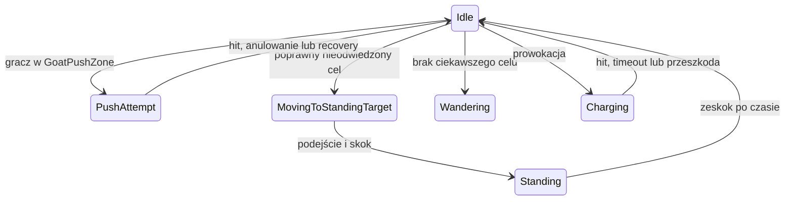

# Systemy NPC

## Status

**Gotowe dla Beaver Scout i Goat, z placeholderowymi modelami/animacjami.**
AI podejmuje decyzje wyłącznie na serwerze. Klienci otrzymują transform,
zdrowie, animacje i stan istotnych zachowań.

## Wspólny `NPCBrain`

| Pole | Znaczenie |
|---|---|
| `definition` | Statystyki, behavior, frakcja i visual |
| `relationshipMatrix` | Relacje do innych frakcji |
| `visualRoot` | Parent runtime visuala |

Brain pobiera `NavMeshAgent`, carrier, health, faction, attack i storage
interactor. `decisionTickInterval` ogranicza częstotliwość decyzji. Zachowania
czasowo przejmujące pełną kontrolę, jak impulse lub charge, mogą wyłączyć tick
i agent.

`SpawnPosition` jest zapamiętywane raz w `Awake`; external impulse ani ponowne
`Enter()` behavioru go nie nadpisuje.

## `NPCDefinitionSO`

| Pole | Znaczenie |
|---|---|
| `npcName` | Nazwa UI/debug |
| `faction` | Faction membership |
| `behavior` | Główny `NPCBehaviorSO` |
| `npcPrefabOverride` | Opcjonalny prefab dla spawnera |
| `visualPrefab` | Model tworzony pod `visualRoot` |
| `maxHealth` | Maksymalne HP |
| `moveSpeed` | Prędkość NavMeshAgent |
| `acceleration` | Przyspieszenie agenta |
| `angularSpeed` | Obrót agenta |
| `decisionTickInterval` | Interwał logiki AI |
| `detectionRadius` | Bazowy zasięg skanów |
| `interactionDistance` | Dystans pickup/atak/delivery |
| `patrolRadius` | Bazowy promień wander/patrol |

## Frakcje

`NPCFactionSO` ma stabilne `factionId` oraz nazwę ekranową `displayName`.
Matrix przechowuje:

- `defaultRelation`;
- wpisy source/target;
- relację Ally/Neutral/Hostile;
- opcjonalny `customBehaviorOverride`.

Brak wpisu korzysta z defaultu. Ta sama frakcja zawsze jest ally.
Neutral Animals nie atakują automatycznie graczy, ale koza może reagować na
dystans lub otrzymane obrażenia.

## Spawner

| Pole `NPCSpawner` | Znaczenie |
|---|---|
| `npcBasePrefab` | Bazowy sieciowy prefab |
| `npcDefinitions` | Losowane/dozwolone definicje |
| `spawnPoints` | Jawne miejsca spawnu |
| `initialSpawnDelay` | Opóźnienie startowe |
| `spawnIntervalMin/Max` | Zakres kolejnych spawnów |
| `maxNPCCount` | Limit żywych NPC tego spawnera |

Spawner przekazuje NPC referencję `OriginSpawner`. Osobne spawners mają osobną
pamięć i limity.

## Zdrowie, atak i animacja

### `NPCAttackController`

| Pole | Znaczenie |
|---|---|
| `attackOrigin` | Punkt testu i line-of-sight |
| `attackDamage` | Damage zwykłego ataku |
| `attackRange` | Maksymalny dystans |
| `attackAngle` | Stożek przed NPC |
| `attackDamageDelay` | Moment trafienia względem animacji |
| `attackTargetLayers` | Warstwy potencjalnych celów |
| `requireLineOfSight` | Blokowanie trafienia przez przeszkody |
| `attackOriginHeight` | Fallback wysokości originu |

Targeted attack przechowuje jeden `PlayerHealth`, ponownie waliduje warunki w
momencie hitu i wywołuje callback. Pending attacks trzeba anulować przy zmianie
behavioru.

### `NPCAnimationController`

| Pole | Znaczenie |
|---|---|
| `animator`, `visualRoot`, `visualController` | Prezentacja |
| `agent`, `carrier`, `health` | Źródła stanu |
| `walkSpeedReference` | Prędkość odpowiadająca normalized 1 |
| `idleSpeedThreshold` | Granica idle |
| `speedDampTime` | Wygładzenie parametru |

Charge może ustawić external normalized speed, ponieważ agent jest wtedy
wyłączony.

## Carry NPC

`NPCCarrier` obsługuje single-carry oraz zachowany kod shared-carry.

| Pole | Znaczenie |
|---|---|
| `carryAnchor`, `bodyAnchor` | Anchory obiektu i ciała |
| `default...LocalPosition` | Fallback offsety |
| `sharedCarryInputStopDistance` | Zatrzymanie intencji NPC |
| `sharedCarryObjectStopDistance` | Tolerancja obiektu |
| `sharedCarryPathRefreshInterval` | Odświeżenie NavMesh |
| pola stuck | Detekcja braku postępu i pauza inputu |
| `sharedCarryTargetSampleRadius` | Dopasowanie celu do NavMesh |
| `collisionRadius` | Clearance carriera |
| pola attachment correction | Ograniczona korekta pozycji |

`IsSharedCarryEnabled` jest obecnie stałe `false`. NPC nie podniesie obiektu
multi-carrier ani nie dołączy do gracza. Single-carry pozostaje aktywne.

## Beaver Scout

### Profile

`NPCInterestProfileSO`:

| Pole | Znaczenie |
|---|---|
| `allowAnyBaseResource` | Akceptuje każdy resource |
| `allowAnyMountableBridgeComponent` | Akceptuje każdy mountable |
| `allowedBaseResources` | Whitelist przy wyłączonym allow-any |
| `allowedMountableBridgeComponents` | Whitelist części |

`NPCDestructionProfileSO.baseResourceRules` mapuje dokładny `BaseResourceSO`
na `EquippableItemType`. Reguła działa tylko, jeśli resource ma zgodną
recepturę destruction.

### `BeaverScoutBehaviorSO`

| Pole | Znaczenie |
|---|---|
| `deliveryMode` | Usunięcie ze świata albo dostawa |
| `interestProfile`, `destructionProfile` | Dozwolone cele |
| `storageWithdrawAmountThreshold` | Minimalna ilość do wycofania |
| `idleSearchDuration` | Czas pełnego skanu |
| `targetRefreshInterval` | Odświeżanie celu |
| `patrolArrivalDistance`, `deliveryDistance` | Tolerancje NavMesh |
| `hitReactionLockDuration` | Blok reakcji po trafieniu |
| `playerFaction` | Rozpoznanie gracza |
| `noticePlayerLockDuration` | Czas zauważenia |
| `followDurationMin/Max` | Losowy czas follow |
| `followRefreshInterval`, `followStoppingDistance` | Parametry follow |
| `attackPrepareDuration`, `attackRecoveryDuration` | Telegraph/recovery |
| `rageHealthThresholdNormalized` | HP uruchamiające rage |
| `rageApproach...` | Odświeżanie i dystans rage |
| `storageSweepPatrolThreshold` | Liczba pustych patroli do sweepu |
| `storageSweepArrivalDistance` | Dystans znanego storage |
| `resourceDestructionAttackInterval` | Odstęp ataków resource |
| `idlePatrolRangeIncrease` | Zwiększenie patrolu po nieudanym idle search |
| `maxPatrolRadius` | Clamp rosnącego patrolu |

Priorytet idle: gracze, storage, carry targets, destruction targets, patrol.
Patrol radius rośnie wtedy, gdy skaut nie znajduje interesującego celu, a nie
przy każdym literalnym wejściu do Idle.

## Goat

### Calm behavior

| Pole | Znaczenie |
|---|---|
| `idleDurationMin/Max` | Losowy czas decyzji |
| `wanderArrivalDistance` | Dystans uznania celu |
| `wanderPointAttempts` | Próby NavMesh |
| `wanderMovesBeforeHomeCorrection` | Co który wybór prowadzi ku spawnowi |
| `homeCorrectionNavMeshSampleRadius` | Dopasowanie midpointu do NavMesh |

Zwykły wander losuje wokół aktualnej pozycji. Co szósty wybrany cel znajduje
się w połowie drogi do `SpawnPosition`. Licznik rośnie przy wyborze celu, więc
przerwanie ruchu go nie cofa.

### Standing

| Pole | Znaczenie |
|---|---|
| `standingTargetProfile` | Dozwolone zasoby i mountable |
| `standingSearchRadius/Interval` | Skan |
| `standingDuration` | Czas na obiekcie |
| `standingApproachDistance` | Dystans do punktu skoku |
| `jumpDuration`, `jumpArcHeight` | Proceduralny łuk |
| `maxJumpHeight`, `maxJumpHorizontalDistance` | Walidacja geometrii |
| `targetMovementTolerance` | Maksymalne przesunięcie celu |
| `stationaryLinear/AngularVelocity` | Warunek stabilności |
| `landingClearance` | Odstęp kapsuły od powierzchni |

`GoatStandingTargetProfileSO` zawiera resource whitelist, allow-all mountable i
opcjonalną whitelistę mountable. `GoatStandingSurface` może jawnie podać
`landingPoint` i wiele `approachPoints`; bez niego działa resolver colliderów.
Każda koza pamięta odwiedzone instancje. Globalna rezerwacja blokuje dwie kozy
na tym samym celu jednocześnie.

### Charging

| Pole | Znaczenie |
|---|---|
| `playerFaction`, `chargeImpulseProfile` | Cel i odrzut |
| `proximityThreatRange/Duration` | Trigger prowokacji |
| `chargeTelegraphDuration` | Przygotowanie |
| `chargeMaxSpeed`, `chargeAcceleration` | Rozpędzanie |
| `chargeSteeringDegreesPerSecond` | Korekta yaw w fazie acceleration |
| `chargeCommittedDuration` | Bieg prosto po locku headingu |
| `chargeDeceleration` | Hamowanie |
| `chargeDamage` | Damage pierwszego celu |
| `chargeCooldown` | Przerwa po wykonanej szarży |
| `chargeCollisionSkin` | Sweep tolerance |
| `chargeBlockedRecoveryDuration` | Recovery po przeszkodzie |

Charge wykonuje sweep kapsuły i kontroluje krawędź NavMesh. Trafienie niesionego
obiektu może zostać przekazane holderom. Knockback korzysta z profilu external
impulse.

### PushAttempt

| Pole behavioru | Znaczenie |
|---|---|
| `pushZoneSearchRadius/Interval` | Wyszukiwanie okazji |
| `pushApproachDistance` | Dystans do strefy |
| `pushSetupDistance` | Pozycja za graczem |
| `pushPositionUpdateInterval` | Aktualizacja ruchomego celu |
| `pushPositionTolerance` | Dystans ustawienia |
| `pushFacingToleranceDegrees` | Wymagany kierunek |
| `pushRecoveryDuration` | Recovery |
| `pushAttemptCooldown` | Przerwa po próbie |

`GoatPushZone`:

| Pole | Znaczenie |
|---|---|
| `approachPoint` | Pierwszy cel NavMesh |
| `localPushDirection` | Kierunek przepaści w local space |
| `pushImpulseProfile` | Damage-independent knockback |
| `setupPositionSampleRadius` | Dopasowanie pozycji za graczem |
| `requirePlayerOnPushSide` | Wymaga poprawnej strony strefy |
| `minimumPushSideDot` | Próg iloczynu skalarnego |

PushAttempt ma pierwszeństwo przed standing/wander, ale otrzymanie obrażeń
przerywa go i może uruchomić defensywną szarżę.

## External impulse NPC

| Pole | Znaczenie |
|---|---|
| `navMeshRecoveryRadius` | Szukanie NavMesh po lądowaniu |
| `offNavMeshDeathDelay` | Czas do śmierci bez recovery |
| `maximumAirborneDuration` | Awaryjny limit lotu |
| `collisionSkin` | Sweep tolerance |
| `groundedProbeDistance` | Test lądowania |

Podczas impulsu behavior wychodzi, carrier dropuje zgodnie z profilem, agent
jest wyłączony. Po lądowaniu NPC wykonuje Warp i ponownie `Enter()` behavioru.

## Ograniczenia

- Modele i część animacji NPC są placeholderowe.
- Shared-carry NPC pozostaje wyłączony.
- Standing opiera się na collider bounds; skomplikowane modele powinny dostać
  `GoatStandingSurface`.
- Jawne GoatPushZone są wymagane; system nie wykrywa automatycznie przepaści.

