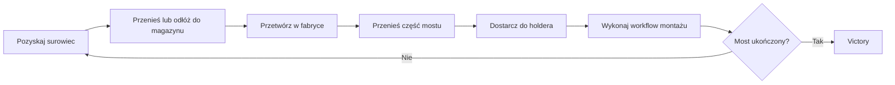

# RageQuitting - dokumentacja projektu

> Stan dokumentacji: 2026-07-28
>
> Unity: `6000.3.18f1`
>
> Zakres: aktywne systemy lobby, `FPP_scene` i `Tutorial_scene`

## Cel dokumentacji

RageQuitting jest kooperacyjną grą FPP o pozyskiwaniu i przetwarzaniu
surowców, fizycznym transporcie ciężkich elementów oraz wieloetapowej budowie
mostu. Dokumentacja opisuje konfigurację gameplayu w Unity, przepływy kodu
oraz zasady synchronizacji multiplayer.

Nazwy klas, pól i assetów pozostają po angielsku, aby można je było łatwo
odnaleźć w Inspectorze i repozytorium.

## Główny loop

## Nawigacja

| Dokument | Zawartość |
|---|---|
| [Architecture-And-Networking](Architecture-And-Networking.md) | NGO, authority, spawn, sceny, restart i synchronizacja |
| [Player-Interaction-And-UI](Player-Interaction-And-UI.md) | ruch, kamera, input, narzędzia, targeting, HUD i downed |
| [Resources-Carrying-And-Physics](Resources-Carrying-And-Physics.md) | zasoby, destruction, single/shared-carry i impulsy |
| [Factories-Storage-And-Production](Factories-Storage-And-Production.md) | magazyny, stół stolarski i piec |
| [Bridge-Construction](Bridge-Construction.md) | komponenty mostu i wszystkie workflow montażu |
| [NPC-Systems](NPC-Systems.md) | wspólne AI, Beaver Scout i Goat |
| [Scenes-Tutorial-And-Level-Flow](Scenes-Tutorial-And-Level-Flow.md) | aktywne sceny, timer i tutorial |
| [Unity-Configuration-Reference](Unity-Configuration-Reference.md) | indeks komponentów, pól i procedury tworzenia contentu |
| [Roadmap-And-Audit](Roadmap-And-Audit.md) | ograniczenia, roadmap oraz rekomendacje techniczne |

## Statusy

| Status | Znaczenie |
|---|---|
| **Gotowe** | Flow działa i jest zintegrowane z aktywną sceną |
| **Częściowe** | Kod działa, ale integracja, content albo przypadki brzegowe są niepełne |
| **Placeholder** | Mechanika lub model istnieje w wersji technicznej |
| **Przygotowane** | SO/prefab istnieje, lecz nie uczestniczy jeszcze w aktywnym poziomie |
| **Wyłączone** | Implementacja pozostała w kodzie, ale blokuje ją feature gate |
| **Deprecated** | Starszy system, którego nie należy używać do nowego contentu |

## Szybkie uruchomienie

### Singleplayer

1. Otwórz `Assets/Scenes/FPP_scene.unity` albo
   `Assets/Scenes/Tutorial_scene.unity`.
2. Uruchom Play Mode bez aktywnej sesji `NetworkManager`.
3. Scenowy `PlayerNew` działa jako fallback singleplayer.
4. W tutorialu timer początkowo czeka na sygnał. Otwórz menu `Tab` i użyj
   `Start timer`.

### Multiplayer

1. Otwórz `Assets/Scenes/MultiplayerStartScene.unity`.
2. Host tworzy pokój, klient dołącza przez istniejący transport NGO.
3. Tylko host może wybrać `FPP_scene` albo `Tutorial`.
4. `PlayerSpawnManager` tworzy osobne player objects po zakończeniu ładowania.
5. Tylko host może uruchomić timer lub restart poziomu z menu `Tab`.

## Aktywne sceny w Build Settings

1. `MultiplayerStartScene`
2. `NGO_Setup`
3. `MainMenuScene`
4. `FPP_scene`
5. `Tutorial_scene`

`NGO_Setup` i `MainMenuScene` są zachowanymi punktami wejścia/testu. Główny
obecny flow korzysta z `MultiplayerStartScene` i dwóch scen gameplayowych.

## Źródła prawdy

- Gameplay: `Assets/Scripts/NewScripts`
- Sieć: `Assets/Scripts/NetworkManagement`
- Ruch FPP: `Assets/StarterAssets/FirstPersonController`
- SO: `Assets/ScriptableObjectAssets/New`
- Prefaby: `Assets/Prefabs/New`
- Sceny: `Assets/Scenes`
- Network prefab registry: asset `DefaultNetworkPrefabs`

Plik `Assets/Project_Overview.md` opisuje starszy etap projektu i jest
dokumentem historycznym. Nie należy używać go jako referencji aktualnych scen,
workflow mostu ani systemu shared-carry.

## Zasady konfiguracji Unity

- Zmieniaj dane gameplayowe w SO, jeśli pole opisuje rodzaj zasobu, narzędzia,
  NPC albo części.
- Zmieniaj prefab, jeśli ustawienie ma być wspólne dla wszystkich instancji.
- Używaj override'u scenowego tylko dla katalogu poziomu, kolejności mostu,
  spawnów, zależności workflow i tutorialowych tekstów.
- Sieciowy prefab musi mieć `NetworkObject` i wpis w
  `DefaultNetworkPrefabs`.
- AI i fizyka shared-carry są autorytatywne po stronie serwera.
- Lokalne UI, feedback kamery, FPS i Camera Motion nie są synchronizowane.
