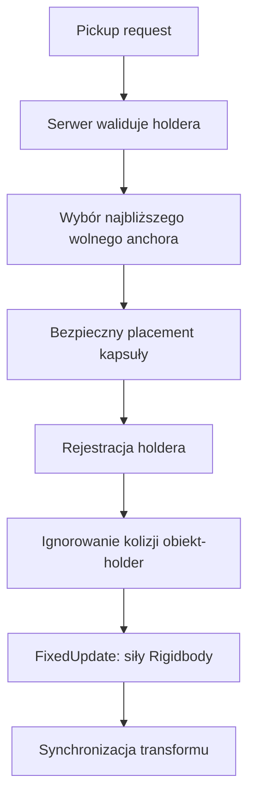

# Zasoby, przenoszenie i fizyka

## Status

**Gotowe, z rozwijanym tuningiem fizyki.** Zasoby mają trwałość, receptury
rozpadu, magazynowanie i carry. Shared-carry używa dynamicznego Rigidbody
symulowanego przez serwer.

## `BaseResourceSO`

| Pole | Znaczenie i zależności |
|---|---|
| `resourceName` | Nazwa UI i magazynów |
| `resourcePrefab` | Sieciowy prefab spawnowany przez utility/receptury |
| `icon` | HUD oraz UI fabryk |
| `baseResourceDestructionRecipeArray` | Dozwolone narzędzia i produkty rozpadu |
| `resourceDurability` | Początkowa trwałość |
| `movementSpeedPenalty` | Kara dla single-carry |
| `canBeCarried` | Blokuje pickup gracza/NPC; false wymusza kinematic Rigidbody bez grawitacji |
| `minAmountOfPlayersNeeded` | Minimalna obsada używana przez carry |
| `allowMultipleCarriers` | Włącza shared-carry |
| `recommendedCarriers` | Liczba normalizująca siłę i warunek understaffed |
| `maxCarriers` | Maksymalna liczba holderów/anchorów |
| `underStaffedPenaltyMultiplier` | Kara ruchu przy niedoborze |
| `sharedCarryUnderstaffedStaminaDrainPerSecond` | Drain staminy każdego player-holdera |
| `carryMoveSpeed` | Docelowa prędkość/intencja carry |
| `carryPlayerClearance` | Odstęp kapsuły gracza od obiektu |
| `carryAttachLocalPoints` | Jawne anchory; pusta lista uruchamia fallback geometryczny |
| `sharedCarryRotationOffsetEuler` | Absolutny offset orientacji przy pierwszym holderze |
| `carryPhysicsProfile` | Opcjonalny profil Rigidbody; null używa fallbacków komponentu |
| `furnaceFuelAmount` | Ilość paliwa dodawana do pieca |

### Receptura zniszczenia

| Pole | Znaczenie |
|---|---|
| `finalProductBaseResourceSO` | Starszy/fallbackowy pojedynczy produkt |
| `neededEquippableItemType` | Jedyny typ narzędzia akceptowany przez recepturę |
| `products` | Lista SO oraz ilości |
| `spawnOffsets` | Lokalnie skonfigurowane pozycje kolejnych produktów |
| `fallbackScatterRadius` | Scatter dla produktów bez odpowiadającego offsetu |
| `scatterSpawnOffsets` | Włącza losowość także dla jawnych offsetów |
| `spawnOffsetScatterRadius` | Maksymalne przesunięcie XYZ |
| `scatterVelocityMin/Max` | Zakres impulsu `VelocityChange` |
| `scatterUpwardBias` | Dodatnia składowa pionowa kierunku |

Scatter i impuls wylicza serwer. Kinematyczny produkt może otrzymać losową
pozycję, ale nie impuls.

## `BaseResourceNew`

| Pole | Znaczenie |
|---|---|
| `baseResourceSO` | Typ i cała konfiguracja zasobu |
| `resourceDurability` | Stan runtime; inicjalizowany z SO |
| `isPickedUp` | Stan runtime/synchronizacji |
| `sharedCarryGroundLayerMask` | Warstwy podłoża dla placementu |
| `sharedCarryGroundRaycastUpOffset` | Początek sondy nad referencyjnym poziomem |
| `sharedCarryGroundRaycastDownDistance` | Maksymalna długość sondy w dół |
| `sharedCarryGroundClearance` | Odstęp collidera od podłoża |
| `sharedCarryGroundVerticalFollowSpeed` | Szybkość korekty wysokości |
| `sharedCarryMaxVerticalPlacementDelta` | Maksymalny teleport holdera w pionie |

`CanBeDestroyed` wynika z niepustych receptur. Produkt bez receptury nie
pokazuje promptu ataku.

## `MountableBridgeComponentSO`

| Pole | Znaczenie |
|---|---|
| `componentName`, `componentSprite` | Nazwa i ikona |
| `inGameGameObjectPrefab` | Sieciowy prefab przenoszonego produktu |
| `requiredResources` | Receptura fabryki |
| `bridgeComponentSO` | Typ holdera/finalnej części |
| `movementSpeedPenalty` | Kara single-carry |
| pola carrierów | Takie samo znaczenie jak w `BaseResourceSO` |
| `meltingPoint` | Temperatura wymagana przez piec |
| `combustionTemperature` | Temperatura spalania/produkcji |
| `neededProgress` | Wymagany ogólny progress produkcji |
| `neededCombustionProgress` | Wymagany progress w warunkach spalania |
| `componentWidth/Length` | Wymiary wybierane/porównywane przez stół stolarski |

`RequiredResource.resourceType` wskazuje SO, a `amount` wymaganą liczbę.

## Single-carry

Zwykły pickup przypisuje jeden holder, ustawia visual/anchor i nakłada karę
ruchu. Gracz pozostaje `CharacterController`. Drop przywraca fizykę obiektu.
Obiekt `canBeCarried == false` nie może wejść w ten flow i pozostaje
kinematyczny.

## Shared-carry

- System sprawdza wszystkie wolne anchory według odległości od `BodyAnchor`.
- Jeśli najbliższy placement jest zablokowany, próbuje kolejnych.
- Pierwszy holder prostuje obiekt do yaw i stosuje rotation offset SO.
- Holderzy nie kolidują z własnym obiektem; osoby postronne i świat nadal tak.
- W/S wysyła translację, A/D osobny input yaw.
- NPC shared-carry jest obecnie wyłączony globalnym feature gate, ale kod
  pozostaje.

### `CarryPhysicsProfileSO`

| Pole | Znaczenie |
|---|---|
| `mass` | Masa Rigidbody |
| `linearDrag`, `angularDrag` | Opór liniowy i kątowy |
| `gripSpring`, `gripDamper` | Starsze parametry grip/fallback |
| `maxGripForce`, `maxGripTorque` | Twarde limity siły i momentu |
| `maxGripDistance` | Maksymalny użyteczny błąd constraintu |
| `maxVelocity`, `maxAngularVelocity` | Limity prędkości |
| `useGravity` | Grawitacja dynamicznego body |
| `allowYawRotation` | Pozwala obracać wyłącznie wokół Y |
| `movementForce`, `movementDamper` | Centralna translacja i jej tłumienie |
| `sharedCarryYawTorque` | Moment dla kanału A/D |
| `horizontalConstraintSpring` | Łączna sztywność pozioma |
| `horizontalConstraintDampingRatio` | Tłumienie względem krytycznego |
| `maxHorizontalConstraintForce` | Clamp korekty holderów |
| `horizontalConstraintDeadZone` | Błąd ignorowany przez solver |
| `horizontalConstraintForceResponse` | Wygładzenie siły korekty |
| `maxHolderAnchorVelocity` | Filtr skoków/opóźnień anchora |
| `verticalSupportSpring` | Centralne podparcie wysokości |
| `verticalSupportDampingRatio` | Tłumienie pionowe |
| `maxVerticalSupportForce` | Clamp wspólnego supportu |

`SharedCarryPhysicsBody` posiada analogiczne pola `default...`. Są używane,
gdy SO nie jest przypisany albo jego wartość nie jest dostępna. Profil jest
preferowanym miejscem tuningu.

### Stamina i damage

- Aktywnie niesiony shared-carry nie zadaje collision damage.
- Po dropie standardowy collision damage może wrócić.
- Niedobór liczy wyłącznie player-holderów.
- Koza trafiająca niesiony obiekt routuje trafienie do holderów przez
  `ICarriedObjectImpactTargetProvider`.
- Wymuszony drop musi wyczyścić carry strain i przywrócić regenerację staminy.

## External impulse

`IExternalImpulseReceiver` oddziela obrażenia od odrzutu. Gracz dodaje
external velocity do `CharacterController`; NPC wyłącza NavMeshAgent i porusza
się serwerowo.

### `ExternalImpulseProfileSO`

| Pole | Znaczenie |
|---|---|
| `horizontalSpeed`, `verticalSpeed` | Początkowa prędkość impulsu |
| `horizontalDeceleration` | Wyhamowanie poziome |
| `gravityMultiplier` | Mnożnik grawitacji |
| `maximumDuration` | Awaryjny limit trwania |
| `movementControlMultiplier` | Zachowana kontrola gracza 0-1 |
| `maximumHorizontalSpeed` | Clamp sumowanych impulsów |
| `maximumVerticalSpeed` | Clamp pionowy |
| `forceDropHeldObject` | Drop przed ruchem |

## Resource population zone

Strefa utrzymuje minimalną liczbę wolnych instancji konkretnego SO w boxie.
AI oraz obiekty niesione nie zwiększają dostępnej populacji.

| Pole | Znaczenie |
|---|---|
| `resourceType` | Dokładna referencja SO liczona i spawnowana |
| `minimumAvailableCount` | Minimalna populacja |
| `populationCheckInterval` | Interwał kontroli |
| `replenishmentCooldown` | Czas ciągłego niedoboru |
| `zoneSize` | Lokalny box, również ograniczenie wysokości jaskini |
| `resourceDetectionLayers` | Warstwy liczenia |
| `spawnSurfaceLayers` | Warstwy dopuszczalnego podłoża |
| `obstacleLayers` | Warstwy clearance |
| `minimumSurfaceUpDot` | Minimalna normalna podłoża/rampy |
| `spawnVerticalOffset` | Offset nad powierzchnią |
| `spawnClearanceRadius/Height` | Wolna kapsuła/objętość |
| `maximumSpawnAttempts` | Próby jednego uzupełnienia |
| `alignToSurfaceNormal` | Dopasowanie orientacji |
| `randomizeYaw` | Losowy obrót Y |
| pola `Runtime debug` | Odczyt, nie konfiguracja |

Raycast rozpoczyna się i kończy wewnątrz pionowego zakresu boxa, dzięki czemu
strefa w jaskini nie wybiera powierzchni nad nią. Clearance musi uwzględniać
inne zasoby, w tym produkty rozpadu.

## Ograniczenia

- Naturalność shared-carry nadal zależy od strojenia masy, springów i
  colliderów konkretnego prefaba.
- NPC shared-carry jest celowo wyłączony.
- Anchory fallbackowe są wystarczające dla prostych brył; finalne modele
  powinny dostać jawne punkty.
- Rotation offset shared-carry nie przywraca orientacji spawn po dropie.

