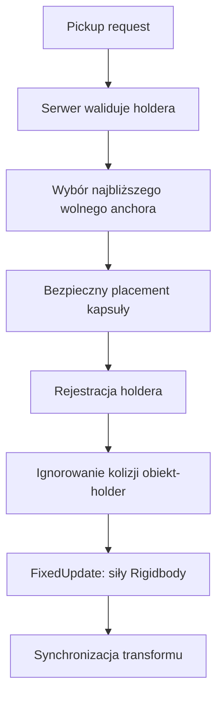

# Zasoby, przenoszenie i fizyka

## Status

**Gotowe, z rozwijanym tuningiem fizyki.** Zasoby mają trwałość, receptury
rozpadu, magazynowanie i carry. Shared-carry używa dynamicznego Rigidbody
symulowanego przez serwer.

## `BaseResourceSO`

| Pole | Znaczenie i zależności |
|---|---|
| `resourceName` | Nazwa UI i magazynów |
| `resourcePrefab` | Sieciowy prefab spawnowany przez utility/receptury |
| `icon` | HUD oraz UI fabryk |
| `impactSurfaceType` | Rodzaj audio/VFX przy trafieniu narzędziem |
| `baseResourceDestructionRecipeArray` | Dozwolone narzędzia i produkty rozpadu |
| `resourceDurability` | Początkowa trwałość |
| `movementSpeedPenalty` | Kara dla single-carry |
| `canBeCarried` | Blokuje pickup gracza/NPC; false wymusza kinematic Rigidbody bez grawitacji |
| `minAmountOfPlayersNeeded` | Minimalna obsada pozwalająca rozpocząć carry; może być niższa od docelowej obsady fizycznej |
| `allowMultipleCarriers` | Włącza shared-carry |
| `recommendedCarriers` | Docelowa obsada fizyczna: normalizuje siły, udźwig, kary understaffed i próg fully-staffed |
| `maxCarriers` | Maksymalna liczba jednoczesnych holderów; nie ogranicza liczby skonfigurowanych anchorów |
| `underStaffedPenaltyMultiplier` | Kara ruchu przy niedoborze |
| `sharedCarryUnderstaffedStaminaDrainPerSecond` | Drain staminy każdego player-holdera |
| `carryMoveSpeed` | Docelowa prędkość/intencja carry |
| `carryPlayerClearance` | Odstęp kapsuły gracza od obiektu |
| `carryAttachLocalPoints` | Jawne anchory w local space; ich liczba może być większa niż `maxCarriers`, a pusta lista uruchamia fallback geometryczny |
| `sharedCarryRotationOffsetEuler` | Absolutny offset orientacji przy pierwszym holderze |
| `carryPhysicsProfile` | Opcjonalny profil Rigidbody; null używa fallbacków komponentu |
| `furnaceFuelAmount` | Ilość paliwa dodawana do pieca |

### Receptura zniszczenia

| Pole | Znaczenie |
|---|---|
| `finalProductBaseResourceSO` | Starszy/fallbackowy pojedynczy produkt |
| `neededEquippableItemType` | Jedyny typ narzędzia akceptowany przez recepturę |
| `products` | Lista SO oraz ilości |
| `spawnOffsets` | Lokalnie skonfigurowane pozycje kolejnych produktów |
| `fallbackScatterRadius` | Scatter dla produktów bez odpowiadającego offsetu |
| `scatterSpawnOffsets` | Włącza losowość także dla jawnych offsetów |
| `spawnOffsetScatterRadius` | Maksymalne przesunięcie XYZ |
| `scatterVelocityMin/Max` | Zakres impulsu `VelocityChange` |
| `scatterUpwardBias` | Dodatnia składowa pionowa kierunku |

Scatter i impuls wylicza serwer. Kinematyczny produkt może otrzymać losową
pozycję, ale nie impuls.

Obrażenia zasobu pochodzą z `EquippableItemSO.ResourceDamage`, a nie z combat
damage przekazanego do wspólnego `IDamageable`. Jawne `resourceDamage > 0`
jest źródłem prawdy. Wartość `0` zachowuje kompatybilność starszych assetów
przez fallback `damage * 2`.

## `BaseResourceNew`

| Pole | Znaczenie |
|---|---|
| `baseResourceSO` | Typ i cała konfiguracja zasobu |
| `resourceDurability` | Stan runtime; inicjalizowany z SO |
| `isPickedUp` | Stan runtime/synchronizacji |
| `sharedCarryGroundLayerMask` | Warstwy podłoża dla placementu |
| `sharedCarryGroundRaycastUpOffset` | Początek sondy nad referencyjnym poziomem |
| `sharedCarryGroundRaycastDownDistance` | Maksymalna długość sondy w dół |
| `sharedCarryGroundClearance` | Odstęp collidera od podłoża |
| `sharedCarryGroundVerticalFollowSpeed` | Szybkość korekty wysokości |
| `sharedCarryMaxVerticalPlacementDelta` | Maksymalny teleport holdera w pionie |

`CanBeDestroyed` wynika z niepustych receptur. Produkt bez receptury nie
pokazuje promptu ataku.

## `MountableBridgeComponentSO`

| Pole | Znaczenie |
|---|---|
| `componentName`, `componentSprite` | Nazwa i ikona |
| `inGameGameObjectPrefab` | Sieciowy prefab przenoszonego produktu |
| `requiredResources` | Dane kompatybilności legacy; aktywna fabryka używa `ProductionRecipeSO` |
| `bridgeComponentSO` | Typ holdera/finalnej części |
| `movementSpeedPenalty` | Kara single-carry |
| pola carrierów | Takie samo znaczenie jak w `BaseResourceSO` |
| `meltingPoint` | Parametr legacy; aktywny piec odczytuje go z `ProductionRecipeSO` |
| `combustionTemperature` | Parametr legacy; aktywny piec odczytuje go z `ProductionRecipeSO` |
| `neededProgress` | Parametr legacy; aktywny piec odczytuje go z `ProductionRecipeSO` |
| `neededCombustionProgress` | Parametr legacy; aktywny piec odczytuje go z `ProductionRecipeSO` |
| `componentWidth/Length` | Wymiary wybierane/porównywane przez stół stolarski |

`RequiredResource.resourceType` wskazuje SO, a `amount` wymaganą liczbę.

## Metalowe półprodukty

Piec produkuje cztery zwykłe `BaseResourceSO`: `Forged Nail Bundle`,
`Bolt & Nut Set`, `Connector Plate Set` oraz `Foundation Anchor Kit`.
Są dynamiczne, przenośne przez jednego gracza, nie mają receptur niszczenia i
nie są paliwem. Carpenter Table zużywa je jako składniki części nowego mostu.

Koszty produkcji, wielkości partii oraz parametry temperatury znajdują się w
`ProductionRecipeSO`, opisanym w
[Factories-Storage-And-Production](Factories-Storage-And-Production.md).

## Single-carry

Zwykły pickup przypisuje jeden holder, ustawia visual/anchor i nakłada karę
ruchu. Gracz pozostaje `CharacterController`. Drop przywraca fizykę obiektu.
Obiekt `canBeCarried == false` nie może wejść w ten flow i pozostaje
kinematyczny.

## Shared-carry

- System sprawdza wszystkie wolne anchory według odległości od `BodyAnchor`.
- Jeśli najbliższy placement jest zablokowany, próbuje kolejnych.
- Pierwszy holder prostuje obiekt do yaw i stosuje rotation offset SO.
- Holderzy nie kolidują z własnym obiektem; osoby postronne i świat nadal tak.
- `DirectYaw`: W/S wysyła centralną translację, a A/D osobny input yaw.
- `PhysicalPointGrip`: siły są przykładane w punktach chwytu, a A/D generuje
  fizyczną siłę boczną i wynikający z miejsca chwytu moment. Wysokość anchora
  jest stała i nie zależy już od pitch kamery.
- `Wooden Log` oraz sześć aktualnych części mostu używają `PhysicalPointGrip`.
  Każdy rodzaj części ma osobny profil dostrojony do swojej geometrii i masy.
- NPC shared-carry jest obecnie wyłączony globalnym feature gate, ale kod
  pozostaje.

### Profile i anchory części mostu

| Część | Profil | Masa | Max angular velocity | Max tilt | Lift/carrier |
|---|---|---:|---:|---:|---:|
| Wooden Foundation | `CarryPhysicsProfile_WoodenFoundationPhysical` | 45 | 1.1 | 35° | 0.38 |
| Wooden Abutment | `CarryPhysicsProfile_WoodenAbutmentPhysical` | 60 | 1.0 | 32° | 0.38 |
| Wooden Main Girder | `CarryPhysicsProfile_WoodenMainGirderPhysical` | 70 | 0.65 | 28° | 0.38 |
| Wooden Cross Beam | `CarryPhysicsProfile_WoodenCrossBeamPhysical` | 24 | 1.2 | 42° | 0.55 |
| Wooden Diagonal Bracing | `CarryPhysicsProfile_WoodenDiagonalBracingPhysical` | 18 | 1.35 | 48° | 0.55 |
| Wooden Deck Panel | `CarryPhysicsProfile_WoodenDeckPanelPhysical` | 30 | 0.9 | 35° | 0.55 |

W aktualnej konfiguracji testowej wszystkie sześć części ma
`minAmountOfPlayersNeeded = 1`, więc pickup jest możliwy solo. Wartość
`recommendedCarriers` pozostaje docelowa: `3` dla Foundation, Abutment i Main
Girder oraz `2` dla Cross Beam, Diagonal Bracing i Deck Panel. Pojedynczy holder
jest zatem obsadą niedoborową i nie uruchamia stabilizacji fully-staffed.

Każda z tych części ma osiem jawnych `carryAttachLocalPoints`: cztery narożniki,
a następnie środki przedniego, prawego, tylnego i lewego boku. Indeksy są
deterministyczne, a serwer przydziela najbliższy wolny i bezpieczny punkt.
Liczba punktów nie zwiększa `maxCarriers`.

Standardowe części mają logiczne anchory odsunięte o około `0.60 m` od obrysu
collidera. `Wooden Abutment` używa offsetu `0.90 m` i wspólnej wysokości
`Y = 0.30 m`, aby kapsuła gracza pozostawała poza pochyłym modelem rampy.
Preview jest rzutowane na powierzchnię visuala, natomiast fizyczna siła chwytu
na powierzchnię collidera; logiczny offset gracza nie zwiększa więc sztucznie
momentu obrotowego.

Po osiągnięciu `recommendedCarriers` sześć profili części mostu uruchamia
serwerowy solver rozkładu udźwigu. Solver rozdziela ciężar między zajęte anchory,
minimalizuje moment pitch/roll i respektuje `pointGripLiftCapacityPerCarrier`.
Pasywny moment jest liczony z finalnej siły chwytu po wygładzaniu i limitach, a
nie tylko z nominalnego podparcia grawitacji. Kompensacja rollu wokół długiej osi
jest aplikowana dokładnie raz; stabilizacja pełnej obsady otrzymuje dopiero
pozostały moment pitch/roll. Dzięki temu oba mechanizmy nie generują przeciwnego
rollu. Miękka sprężyna poziomowania przywraca orientację zapisaną na początku
carry. Yaw, A/D i kolizje pozostają fizyczne, a aktywacja pełnej obsady jest
płynnie blendowana.

### `CarryPhysicsProfileSO`

| Pole | Znaczenie |
|---|---|
| `controlMode` | Aktywnie używane tryby: `DirectYaw` i `PhysicalPointGrip` |
| `pointGripLateralForce` | Siła A/D przykładana w fizycznym punkcie chwytu |
| `pointGripVerticalForce`, `pointGripSpring`, `pointGripDamping` | Pionowa skala, sprężyna i tłumienie indywidualnego chwytu |
| `pointGripMaxForce` | Limit siły pojedynczego constraintu przed normalizacją carrierów |
| `projectGripForcesToColliderSurface` | Oddziela logiczny anchor gracza od punktu przyłożenia siły na colliderze |
| `limitPointGripLiftByCarrierCapacity` | Włącza limit dodatniej siły pionowej na holdera |
| `pointGripLiftCapacityPerCarrier` | Część całkowitego ciężaru dostępna pojedynczemu holderowi |
| `limitTilt`, `maximumTiltAngle` | Włącza miękkie ograniczenie przechyłu i jego próg |
| `tiltRestoringTorque`, `tiltDamping` | Sprężyna oraz tłumienie soft tilt |
| `stabilizeWhenFullyStaffed` | Włącza solver udźwigu i poziomowanie po osiągnięciu wymaganej obsady |
| `fullyStaffedLoadDistributionRegularization` | Preferencja równego podziału, gdy kilka rozkładów daje podobny moment |
| `fullyStaffedLevelingTorque` | Siła sprężyny przywracającej początkowy pitch/roll |
| `fullyStaffedLevelingDeadZone` | Kąt w stopniach ignorowany przez poziomowanie |
| `fullyStaffedTiltDamping` | Tłumienie prędkości pitch/roll przy pełnej obsadzie |
| `fullyStaffedMaximumTorque` | Wspólny limit kompensacji i poziomowania |
| `fullyStaffedStabilizationBlendDuration` | Czas płynnego włączania i wyłączania stabilizacji |
| `softTetherDeadZone`, `softTetherPullSpeed` | Martwa strefa i prędkość korekty gracza do anchora |
| `hardTetherDistance`, `tetherBreakDelay` | Dystans i czas prowadzące do indywidualnego force release |
| `preventGroundedUpwardTether` | Nie pozwala tetherowi odrywać uziemionego gracza od podłoża |
| `mass` | Masa Rigidbody |
| `linearDrag`, `angularDrag` | Opór liniowy i kątowy |
| `gripSpring`, `gripDamper` | Starsze parametry grip/fallback |
| `maxGripForce`, `maxGripTorque` | Twarde limity siły i momentu |
| `maxGripDistance` | Maksymalny użyteczny błąd constraintu |
| `maxVelocity`, `maxAngularVelocity` | Limity prędkości |
| `useGravity` | Grawitacja dynamicznego body |
| `allowYawRotation` | Pozwala obracać wyłącznie wokół Y |
| `movementForce`, `movementDamper` | Centralna translacja i jej tłumienie |
| `sharedCarryYawTorque` | Moment dla kanału A/D |
| `horizontalConstraintSpring` | Łączna sztywność pozioma |
| `horizontalConstraintDampingRatio` | Tłumienie względem krytycznego |
| `maxHorizontalConstraintForce` | Clamp korekty holderów |
| `horizontalConstraintDeadZone` | Błąd ignorowany przez solver |
| `horizontalConstraintForceResponse` | Wygładzenie siły korekty |
| `maxHolderAnchorVelocity` | Filtr skoków/opóźnień anchora |
| `verticalSupportSpring` | Centralne podparcie wysokości |
| `verticalSupportDampingRatio` | Tłumienie pionowe |
| `maxVerticalSupportForce` | Clamp wspólnego supportu |

`SharedCarryPhysicsBody` posiada analogiczne pola `default...`. Są używane,
gdy SO nie jest przypisany albo jego wartość nie jest dostępna. Profil jest
preferowanym miejscem tuningu.

### Stamina i damage

- Aktywnie niesiony shared-carry nie zadaje collision damage.
- Po dropie standardowy collision damage może wrócić.
- Niedobór liczy wyłącznie player-holderów.
- Koza trafiająca niesiony obiekt routuje trafienie do holderów przez
  `ICarriedObjectImpactTargetProvider`.
- Wymuszony drop musi wyczyścić carry strain i przywrócić regenerację staminy.

### Powalony gracz jako obiekt carry

`DownedPlayerCarryable` może być niesiony przez `PlayerInteractionNew` albo
`NPCCarrier`. Wspólny `ICarriedPlayerAnchorProvider` zwraca anchor pozycji;
obrońca używa osobnego punktu nad grzbietem i poziomej rotacji visuala.
Rejestr holderów używa `NetworkObjectId`, a `DownedPlayerCarryReservation`
zapobiega jednoczesnemu pickupowi przez kilka NPC.

Pickup NPC wyłącza `CharacterController` gracza, ignoruje kolizje z carrierem
i zatrzymuje timer respawnu. Każda centralna ścieżka dropu przywraca kontroler,
kolizje, visual override, timer oraz oba końce relacji carry. Operacje są
idempotentne, aby śmierć, despawn i external impulse mogły bezpiecznie wykonać
force release.

## External impulse

`IExternalImpulseReceiver` oddziela obrażenia od odrzutu. Gracz dodaje
external velocity do `CharacterController`; NPC wyłącza NavMeshAgent i porusza
się serwerowo.

### `ExternalImpulseProfileSO`

| Pole | Znaczenie |
|---|---|
| `horizontalSpeed`, `verticalSpeed` | Początkowa prędkość impulsu |
| `horizontalDeceleration` | Wyhamowanie poziome |
| `gravityMultiplier` | Mnożnik grawitacji |
| `maximumDuration` | Awaryjny limit trwania |
| `movementControlMultiplier` | Zachowana kontrola gracza 0-1 |
| `maximumHorizontalSpeed` | Clamp sumowanych impulsów |
| `maximumVerticalSpeed` | Clamp pionowy |
| `forceDropHeldObject` | Drop przed ruchem |

`EquippableItemSO.impactImpulseProfile` pozwala wykorzystać ten sam system przez
broń lub narzędzie. `PlayerActionController` aplikuje profil dopiero po
serwerowym potwierdzeniu trafienia żywego `PlayerHealth` albo `NPCHealth`.
Kierunek poziomy biegnie od atakującego do celu. Industrial Hammer korzysta z
profilu `IndustrialHammerImpactImpulse`; Shovel i pozostałe obecne narzędzia
nie mają profilu. Impuls wymuszający drop korzysta z istniejących ścieżek
single-carry i shared-carry.

## Resource population zone

Strefa utrzymuje minimalną liczbę wolnych instancji konkretnego SO w boxie.
AI oraz obiekty niesione nie zwiększają dostępnej populacji.

| Pole | Znaczenie |
|---|---|
| `resourceType` | Dokładna referencja SO liczona i spawnowana |
| `minimumAvailableCount` | Minimalna populacja |
| `populationCheckInterval` | Interwał kontroli |
| `replenishmentCooldown` | Czas ciągłego niedoboru |
| `zoneSize` | Lokalny box, również ograniczenie wysokości jaskini |
| `visitPoint` | Opcjonalny jawny punkt wizyty NPC; null uruchamia automatyczny wybór NavMesh wewnątrz boxa |
| `resourceDetectionLayers` | Warstwy liczenia |
| `spawnSurfaceLayers` | Warstwy dopuszczalnego podłoża |
| `obstacleLayers` | Warstwy clearance |
| `minimumSurfaceUpDot` | Minimalna normalna podłoża/rampy |
| `spawnVerticalOffset` | Offset nad powierzchnią |
| `spawnClearanceRadius/Height` | Wolna kapsuła/objętość |
| `maximumSpawnAttempts` | Próby jednego uzupełnienia |
| `alignToSurfaceNormal` | Dopasowanie orientacji |
| `randomizeYaw` | Losowy obrót Y |
| pola `Runtime debug` | Odczyt, nie konfiguracja |

Raycast rozpoczyna się i kończy wewnątrz pionowego zakresu boxa, dzięki czemu
strefa w jaskini nie wybiera powierzchni nad nią. Clearance musi uwzględniać
inne zasoby, w tym produkty rozpadu.

Aktywne strefy rejestrują się w runtime `ResourcePopulationZone.ActiveZones`.
`GetClosestPoint()` pozwala AI wykrywać volume bez fizycznego collidera, a
`TryGetNpcVisitPosition()` wymaga kompletnej ścieżki NavMesh. Automatycznie
znaleziony punkt musi pozostać wewnątrz boxa także w osi Y, dlatego nie wybierze
NavMesh na powierzchni nad jaskinią. Jawny `visitPoint` służy jako override dla
nietypowych poziomów i powinien być ustawiony na osiągalnym NavMesh.

## Ograniczenia

- Naturalność shared-carry nadal zależy od strojenia masy, springów i
  colliderów konkretnego prefaba.
- Test solo sprawdza pickup i zachowanie niedoborowej obsady; stabilność
  fully-staffed trzeba weryfikować osobno z docelowymi dwoma lub trzema holderami.
- NPC shared-carry jest celowo wyłączony.
- Fallback geometryczny pozostaje dla prostych i legacy prefabów; Wooden Log
  oraz sześć aktualnych części mostu mają jawne punkty.
- Rotation offset shared-carry nie przywraca orientacji spawn po dropie.

## Usuwanie zasobow w rzece

**Status:** zaimplementowane dla `BaseResourceNew`.

`RiverBedCleanupZone` jest serwerowym triggerem umieszczonym przy dnie rzeki. Po kontakcie wyszukuje root zasobu, deduplikuje zdarzenia colliderow, zwalnia holderow i wywoluje `BaseResourceNew.RemoveFromWorld(EnvironmentalRemovalReason.RiverBed)`.

- Usuwane sa tylko obiekty `BaseResourceNew`.
- Narzedzia, czesci mostu, gracze i NPC nie sa usuwani przez ten trigger.
- Utrata jest trwala; cleanup nie zwraca produktu i nie uruchamia dodatkowego respawnu.
- Despawn wykonuje wylacznie serwer, dlatego klient nie moze samodzielnie usunac zasobu.
- `GameplayManager.EnableRiverBedResourceRemoval` wlacza lub wylacza cleanup dla calej sceny.
- Przy wylaczonej fladze obiekt nie trafia do zbioru deduplikacji, dlatego ponowne wlaczenie pozwala usunac zasob nadal lezacy w triggerze.

Przy dodawaniu kolejnych akwenow nalezy tworzyc osobny trigger dna i pozostawic go wewnatrz gameplay volume odpowiadajacego mu `WaterBody`.

## Thorny Bush

`Thorny Bush` jest nieruchomym `BaseResourceNew` uzywanym jako przeszkoda etapu `Clearing` fundamentow. Nie mozna go podniesc. Ma `15` durability, rozpada sie po jednym trafieniu `Axe` albo trzech trafieniach bez narzedzia i tworzy jeden `Wooden Shards`.

Trigger placu fundamentu jest podczas `Clearing` miekkim celem targetowania. Zachowuje informacyjny prompt, ale pozwala dalszemu interaktywnemu lub podatnemu na obrazenia obiektowi, w tym krzakowi, przejac `CurrentTarget`. Solidna geometria nadal blokuje promien.
